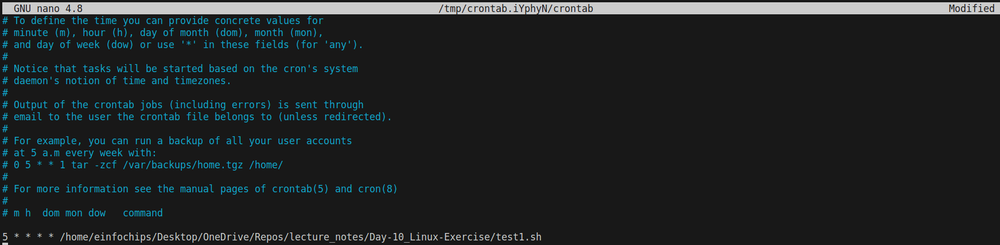
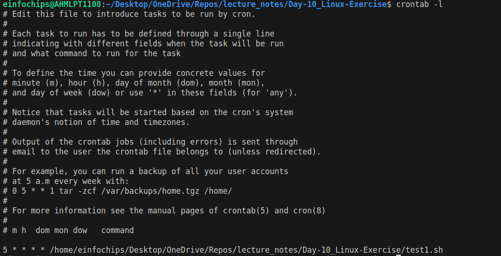

# Project Overview
Develop a comprehensive shell script for sysops to automate system monitoring and generate detailed reports. The script will leverage advanced Linux shell scripting techniques to monitor system metrics, capture logs, and provide actionable insights for system administrators. 

## Deliverables

### Script Initialization
- Create the script file script.sh and give the execution permission as shown below
```
touch script.sh
chmod 744 script.sh
vim script.sh
```
- Initialize script with necessary variables and configurations.

```bash
#!/bin/bash

### Script Initialization

# Initialize variables and configurations
LOG_FILE="system_monitor.log"
TIMESTAMP=$(date +"%Y-%m-%d_%H:%M:%S")
REPORT_FILE="`pwd`/report_$TIMESTAMP.txt"
LOG_FILE="`pwd`/log_$TIMESTAMP.log"
CPU_THRESHOLD=50  
MEM_THRESHOLD=50  
EMAIL_ADDRESS="example@gmail.com"
SYSLOG_FILE="/var/log/syslog"
SEVERITY=("ERROR" "WARNING" "CRITICAL")
```
- Validate required commands and utilities availability.

```bash
# Validate required commands and utilities availability
check_commands() {
    local commands=("top" "mpstat" "ping" "df" "free" "netstat" "grep" "awk" "mail")
    echo "Validation of Required Commands:"
    for cmd in "${commands[@]}"; do
        if ! command -v "$cmd" > /dev/null; then
            echo "Error: '$cmd' command not found. Please install it."
            exit 1
        else
            echo "Command '$cmd' is Ready!..."
        fi
    done

    echo "-------------------------------------------------------------------------------"
}
```

### System Metrics Collection
- Monitor CPU usage, memory utilization, disk space, and network statistics.
- Also capture process information including top processes consuming resources.

```bash
### System Metrics Collection:

system_metrics() {
    echo "Collecting System Metrics:"
    echo "CPU Usage:"
    mpstat 1 1
    echo "-------------------------------------"
    echo "Memory Utilization:"
    free -m
    echo "-------------------------------------"
    echo "Disk Space:"
    df -h
    echo "-------------------------------------"
    echo "Network Statistics:"
    netstat -tulpn
    echo "-------------------------------------"
    echo "Top Processes by CPU and Memory Usage:"
    ps aux --sort=-%cpu,%mem | head -n 11

    echo "-------------------------------------------------------------------------------"
}
```

### Log Analysis
- Parse system logs (e.g., syslog) for critical events and errors.
- Generate summaries of recent log entries based on severity.

```bash
### Log Analysis: 

generate_summary() {
    echo "Log Analysis"
    for severity in "${SEVERITY[@]}"; do
        echo "$severity:"
        grep -i $severity $SYSLOG_FILE
    done

    echo "-------------------------------------------------------------------------------"
}
```

### Health Checks
- Check the status of essential services (e.g., Apache, MySQL).
- Verify connectivity to external services or databases.
```bash
### Health Checks: 

perform_health_check() {
    echo "Health Checks"
    # Check service status
    echo "Performing Health Checks..."
    systemctl status apache2
    echo "-------------------------------------"
    systemctl status mysql
    echo "-------------------------------------"

    # Check connectivity to an external service
    echo "Verifying Connectivity to External Services:"
    ping -c 4 google.com
    echo "-------------------------------------"
    mysql_test=$(mysql -u root -p'password' -e 'SELECT 1' 2>/dev/null)
    if [ $? -eq 0 ]; then
        echo "MySQL Database is up and running."
    else
        echo "MySQL Database connection Failed"
    fi
    echo "-------------------------------------------------------------------------------"
}
```

### Alerting Mechanism
- Implement thresholds for critical metrics (CPU, memory) triggering alerts.
- Send email notifications to sysadmins with critical alerts.
```bash
### Alerting Mechanism:

send_email_alert() {
    local cpu_usage=$(mpstat | awk '$14 ~ /[0-9.]+/ { print 100 - $14 }')
    local memory_usage=$(free | awk '/Mem/ { printf("%.0f"), $3/$2 * 100.0 }')
    echo "Checking the CPU and MEMORY Usage: "
    if (( $(echo "$cpu_usage > $CPU_THRESHOLD" | bc -l) )) || (( "$memory_usage" > "$MEM_THRESHOLD" )); then
        local message="High CPU or Memory usage is Detected: CPU ($cpu_usage %) and MEMORY ($memory_usage %)"
        local subject="Critical Alert: High CPU or MEMORY Usage"
        echo "$message"
        
        # echo "$message" | mail -s "$subject" $EMAIL_ADDRESS
    else
        echo "Everything looks good!"
    fi

    echo "-------------------------------------------------------------------------------"
}
```

### User Interaction
- Provide options for interactive mode to allow sysadmins to manually trigger checks or view specific metrics.
- Ensure the script is user-friendly with clear prompts and outputs.
```bash
### Interactive Mode:

# Check if the script is run in interactive mode
read -p "Want to run the script in Interactive Mode (yes|no): " MODE

if [[ "$MODE" == "yes" ]]; then
    INTERACTIVE_MODE=true
else
    INTERACTIVE_MODE=false
fi


if $INTERACTIVE_MODE; then
    echo "Select the function you want to run:"
    echo "1. Check Commands"
    echo "2. System Metrics"
    echo "3. Generate Summary"
    echo "4. Perform Health Check"
    echo "5. Send Email Alert"
    read -p "Enter your choice (1-5): " choice

    case $choice in
        1) check_commands ;;
        2) system_metrics ;;
        3) generate_summary ;;
        4) perform_health_check ;;
        5) send_email_alert ;;
        *) echo "Invalid choice. Exiting." ;;
    esac
```

### Report Generation
- Compile all collected data into a detailed report.
- Include graphs or visual representations where applicable.
```bash
else
    # If not in interactive mode, run all functions and save to report file
    {
        check_commands
        system_metrics
        generate_summary
        perform_health_check
        send_email_alert
    } > "$REPORT_FILE"
    cp $REPORT_FILE $LOG_FILE
    echo "Report generated: $REPORT_FILE"
fi
```

### Automation and Scheduling
- Configure the script to run periodically via cron for automated monitoring.
```bash
crontab -e
```


- To verify the cronjob is placed run this command
```bash
crontab -l
```


