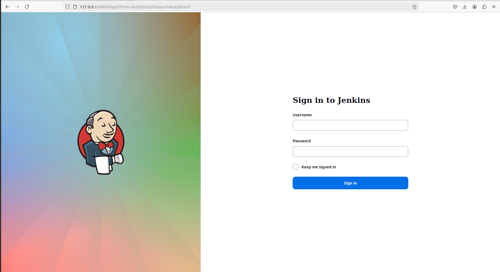
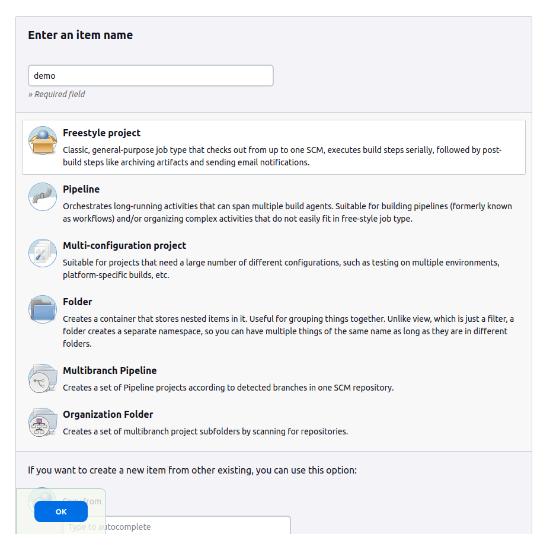
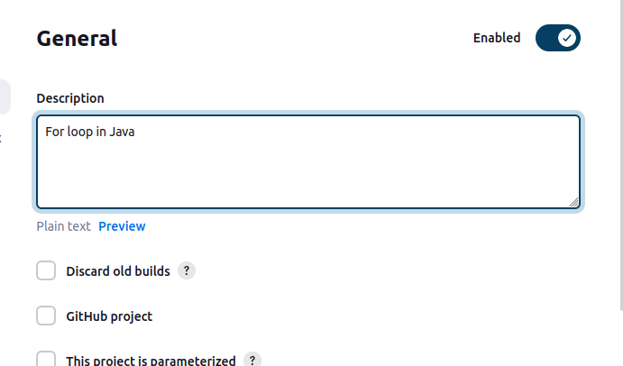
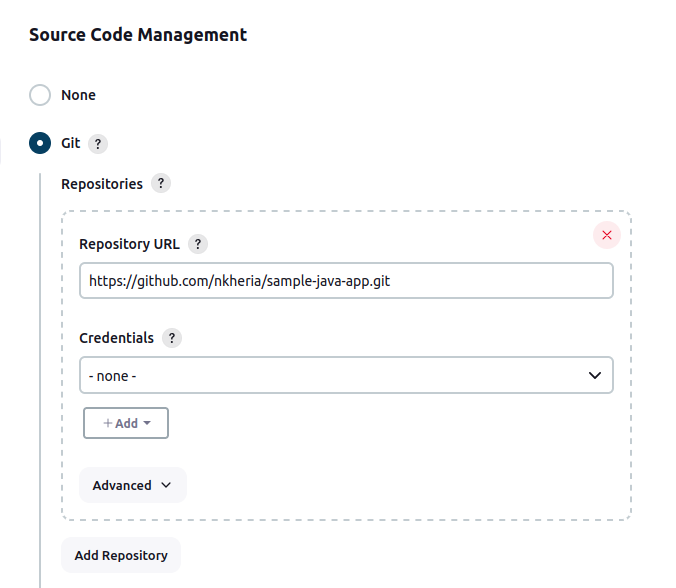
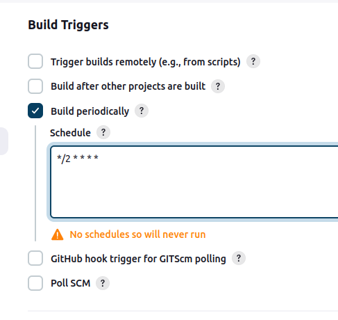
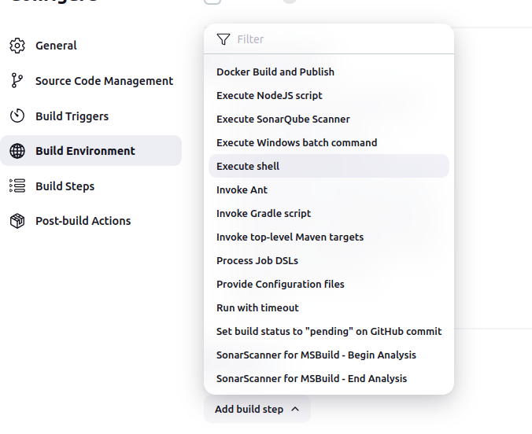
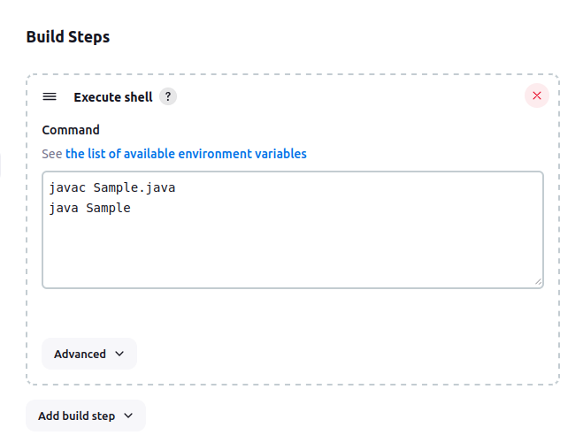
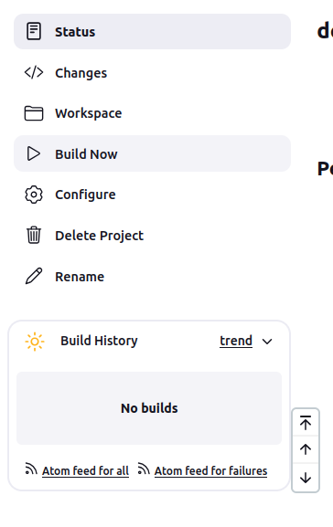
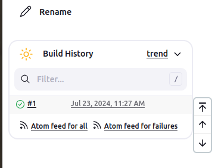
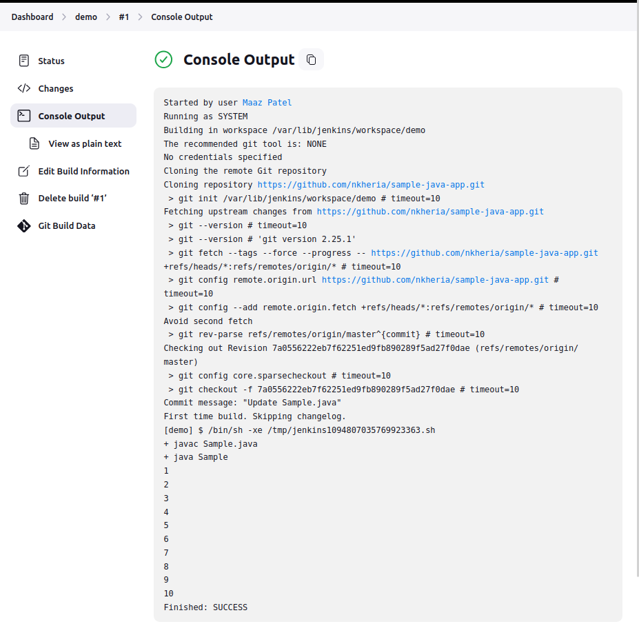

# Create a New Build Job in Jenkins Freestyle Project

The freestyle build job is a highly flexible and easy-to-use option. You can use it for any type of project; it is easy to set up, and many of its options appear in other build jobs. Below is a step by step process to create job in Jenkin.

### Step1: Login to Jenkins

To create a Jenkins freestyle job, log on to your Jenkins dashboard by visiting your Jenkins installation path. Usually, it will be hosted on localhost at http://localhost:8080 If you have installed Jenkins in another path, use the appropriate URL to access your dashboard as shown in the below Jenkins job creation example.

<p align="center"><p>


### Step2: Create New Item

Click on “New Item” at the top left-hand side of your dashboard.

<p align="center"><p>


### Step3: Enter Item Details

In the next screen,

1. Enter the name of the item you want to create. We shall use the “demo” for this demo.
2. Select Freestyle project
3. Click Okay

<p align="center"><p>

### Step4: Enter Project Details

Enter the details of the project you want to test.

<p align="center"><p>

### Step5: Enter Repository URL

Under Source Code Management, Enter your repository URL. We have a test repository located at https://github.com/nkheria/sample-java-app.git

<p align="center"><p>

It is also possible for you to use a local repository.

**Note: ** If your GitHub repository is private, Jenkins will first validate your login credentials with GitHub and only then pull the source code from your GitHub repository.

### Step6: Enter Custom CronJob 

Enter Crontab for your periodic build.

<p align="center"><p>


### Step7: Enter Build Steps

Now that you have provided all the details, it’s time to build the code. Tweak the settings under the build section to build the code at the time you want. You can even schedule the build to happen periodically, at set times.

Under build,

1. Click on “Add build step”
2. Click on “Execute shell” and add the commands you want to execute during the build process.

<p align="center"><p>

Here, I have added the java commands to compile the java code.
I have added the following windows commands:

```bash
javac Sample.java
java Sample
```
<p align="center"><p>


### Step8: Save the Project

When you have entered all the data,

Click Apply
Save the project.


### Step9: Build Source code

Now, in the main screen, Click the Build Now button on the left-hand side to build the source code.

<p align="center"><p>


### Step10: Check the Status

After clicking on Build now, you can see the status of the build you run under Build History.

<p align="center"><p>


### Step11: See the Console Output

Click on the build number and then Click on console output to see the status of the build you run. It should show you a success message, provided you have followed the setup properly as shown in the below Jenkins create new job example.

<p align="center"><p>

In sum, we have executed a Sample program hosted on GitHub. Jenkin pulls the code from the remote repository and builds continuously at a frequency you define.

## Summary
- Jenkins Freestyle Project is a repeatable build job, script, or pipeline that contains steps and post-build actions. It is an improved job or task that can span multiple operations.
- The types of actions you can perform in a build step or post-build action are quite limited. There are many standard plugins available within a Jenkins Freestyle Project to help you overcome this problem.
- Freestyle build Jenkins jobs are highly flexible and easy-to-use. You can use it for any type of project; it is easy to set up, and many of its options appear in other build Jenkins jobs.
- If your GitHub repository is private, Jenkins will first validate your login credentials with GitHub and only then pull the source code from your GitHub repository.