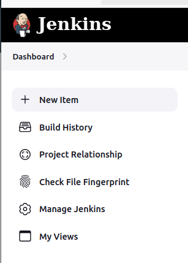

# Create a Maven Project with Build Pipeline View

The freestyle build job is a highly flexible and easy-to-use option. You can use it for any type of project; it is easy to set up, and many of its options appear in other build jobs. Below is a step by step process to create job for Maven project in Jenkin.

### Step1: Login to Jenkins

To create a Jenkins freestyle job, log on to your Jenkins dashboard by visiting your Jenkins installation path. Usually, it will be hosted on localhost at http://localhost:8080 If you have installed Jenkins in another path, use the appropriate URL to access your dashboard as shown in the below Jenkins job creation example.

### Step2: Jenkins Management

Click on “Manage Jenkins” at the top left-hand side of your dashboard.

### Step3: System Configuration

Click on “Tools” under System CConfiguration of your dashboard.

### Step4: Add Maven Version

Under Maven installations add Maven with:
- Name: "Maven-3.9.0"
- Version: 3.9.0

Save the changes.

### Step5: Create Git Credentials 

Create PAT (Personal Access Token) in GitHub.

### Step6: Set Credentials in Jenkins

Dashboard > Manage Jenkins > Credentials > System > Global credentials (unrestricted)

Create New Credentials for Jenkins to access Private Repository.

Here, I have added the GitHub Token as username and password. 

### Step7: Create New Item

Click on “New Item” at the top left-hand side of your dashboard.

### Step8: Enter Item Details

In the next screen,

1. Enter the name of the item you want to create. We shall use the “Dev-Compile” for this project.
2. Select Freestyle project
3. Click Okay

### Step9: Enter Repository URL

Under Source Code Management, Enter your repository URL. We have a test repository located at https://github.com/maazpatel24/DevOpsClassCode.git

It is also possible for you to use a local repository.

**Note:  If your GitHub repository is private, Jenkins will first validate your login credentials with GitHub and only then pull the source code from your GitHub repository.**

### Step10: Enter Build Steps

Now that you have provided all the details, it’s time to build the code. Tweak the settings under the build section to build the code at the time you want.

Under build,

1. Click on “Add build step”
2. Click on “Invokev top-level Maven target” and select Maven Version we added in Step4.

Here, I have selected Maven-3.9.0 and Goals we have to compile so we write "compile"

### Step11: Save the Project

When you have entered all the data,

Click Apply
Save the project.

### Step12: Build Source code

Now, in the main screen, Click the Build Now button on the left-hand side to build the source code.

### Step13: Check the Status

After clicking on Build now, you can see the status of the build you run under Build History.

### Step14: See the Console Output

Click on the build number and then Click on console output to see the status of the build you run.

### Step15: Create Second Project "Dev-Test"

Similarly we need to create second freestyle project name "Dev-Test" for testing.

Follow steps 8, 9, 10 & 11

In Step11 under Maven goal write "test".

### Step16: Configure Post Build action in "Dev-Compile"

To triggere or run "Dev-Test" after successful build of "Dev-Compile" Project. 

Select "Build other Projects"

Select "Dev-Test" project to run after "Dev-Compile"

Save the changes.

### Step17: Create New View

Create new view of Type "Build Pipeline"

**Note: If you cannot see the option of "build pipeline" install pluging for that.**

### Step18: Project View

After the view configurations.

This is the final Project View.

## Summary
- In sum, we have 2 executed a java program hosted on Private GitHub repository. Jenkin pulls the code from the private remote repository and builds continuously at a frequency we define.
- Also created custom project view of freeStyle project.