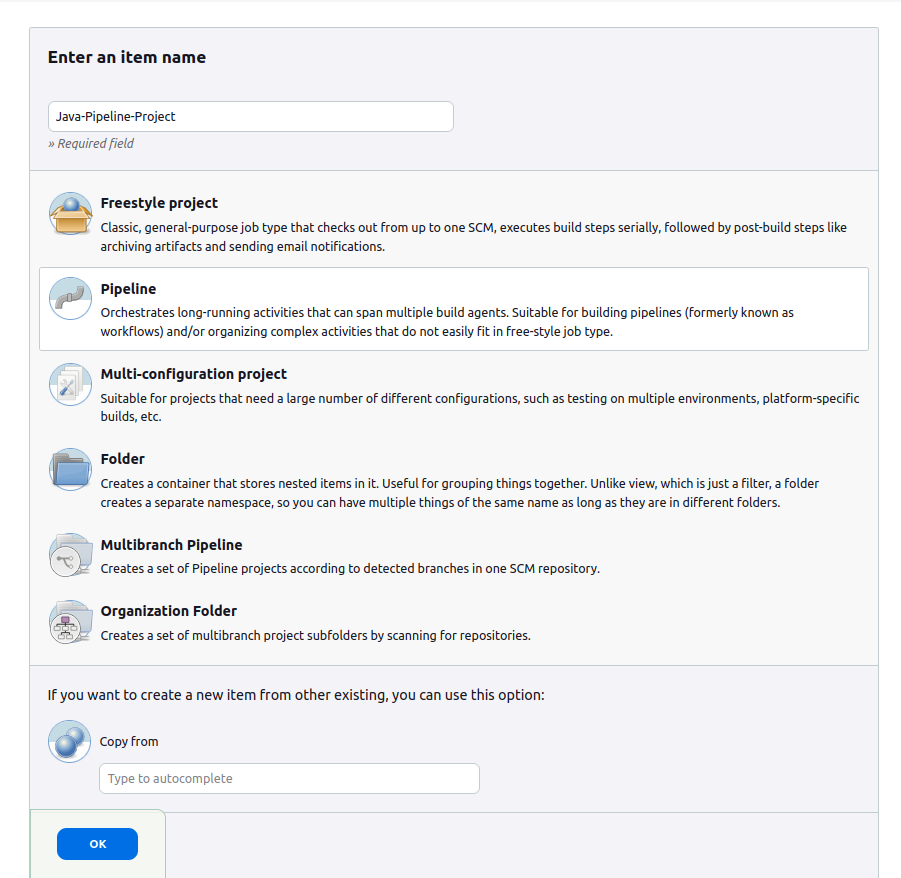

# Create a Pipeline Project for Simple Java in Jenkins

The freestyle build job is a highly flexible and easy-to-use option. You can use it for any type of project; it is easy to set up, and many of its options appear in other build jobs. Below is a step by step process to create job in Jenkin.

### Step1: Write Jenkinsfile 

```Jenkinsfile
pipeline {
    agent any

    environment {
        MAVEN_HOME = tool 'Maven-3.9.0' // Ensure this matches your Maven tool name
    }

    stages {
        stage('CheckOut') {
            steps {
                // Checkout code from Git repository
                git credentialsId: 'git-access', url: 'https://github.com/maazpatel24/DevOpsClassCode.git' 
            }
        }
        stage('Build') {
            steps {
                // Build the project using Maven
                script {
                    withEnv(["PATH+MAVEN=${MAVEN_HOME}/bin"]) {
                        sh 'mvn clean install'
                    }
                }
            }
        }
        stage('Test') {
            // Run tests using Maven
            steps {
                script {
                    withEnv(["PATH+MAVEN=${MAVEN_HOME}/bin"]) {
                        sh 'mvn clean install'
                    }
                }
            }
        }
        stage('Archive Artifacts') {
            steps {
                // Archive the built artifacts
                archiveArtifacts artifacts: '**/target/*.jar', allowEmptyArchive: true
            }
        }
    }

    post {
        always {
            echo 'Pipeline finished.'
        }
        success {
            echo 'Pipeline succeeded.'
        }
        failure {
            echo 'Pipeline failed.'
        }
    }
}
```


### Step2: Login to Jenkins

To create a Jenkins Pipeline project, log on to your Jenkins dashboard by visiting your Jenkins installation path. Usually, it will be hosted on localhost at http://localhost:8080 If you have installed Jenkins in another path, use the appropriate URL to access your dashboard as shown in the below Jenkins job creation example.

<p align="center"><p>


### Step3: Create New Item

Click on “New Item” at the top left-hand side of your dashboard.

<p align="center"><p>


### Step4: Enter Item Details

In the next screen,

1. Enter the name of the item you want to create. We shall use the “Java-Pipeline-Project” for this demo.
2. Select Pipeline
3. Click Okay

<p align="center"><p>

### Step5: Enter Pipeline Configuration

1. Select "Pipeline script from SCM" under Pipeline Definition.
2. Select "Git" in SCM field.
3. Enter git repository https://github.com/maazpatel24/DevOpsClassCode.git 
4. Select proper credentials to access *Private repository*

**Note: Jenkinsfile should be present in the repository.**

<p align="center"><p>


### Step6: Save the Project

When you have entered all the data,

Click Apply
Save the project.


### Step7: Build Source code

Now, in the main screen, Click the Build Now button on the left-hand side to build the source code.

<p align="center"><p>


### Step8: Check the Status

After clicking on Build now, you can see the status of the build you run.

<p align="center"><p>


### Step9: See the Console Output

Click on the build number and then Click on console output to see the status of the build you run. It should show you a success message, provided you have followed the setup properly as shown in the below Jenkins create new job example.

<p align="center"><p>

In sum, we have created Jenkinsfile to run java project in pipeline project.