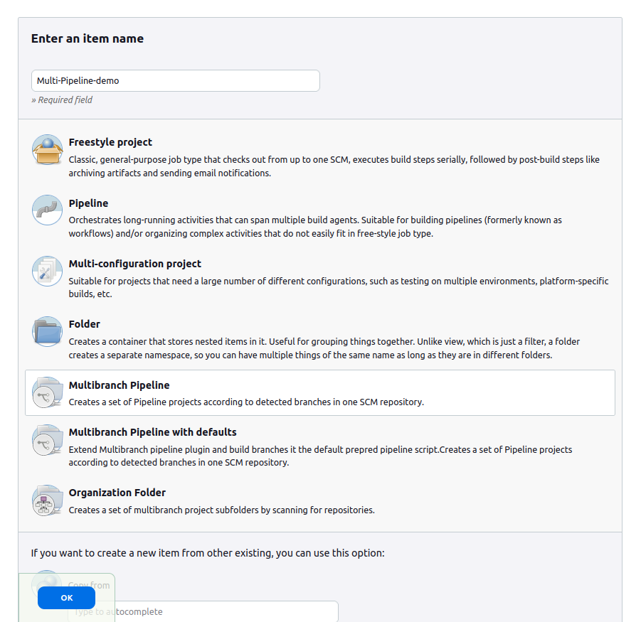
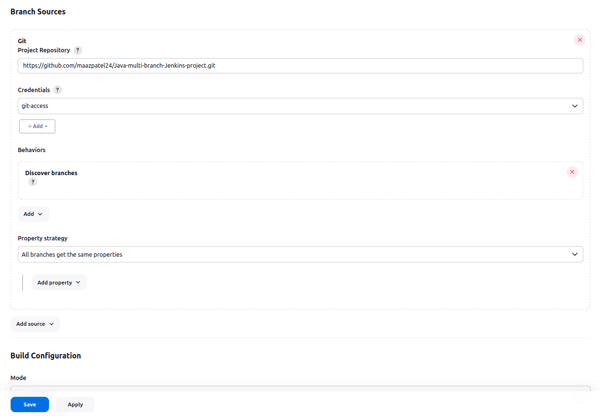
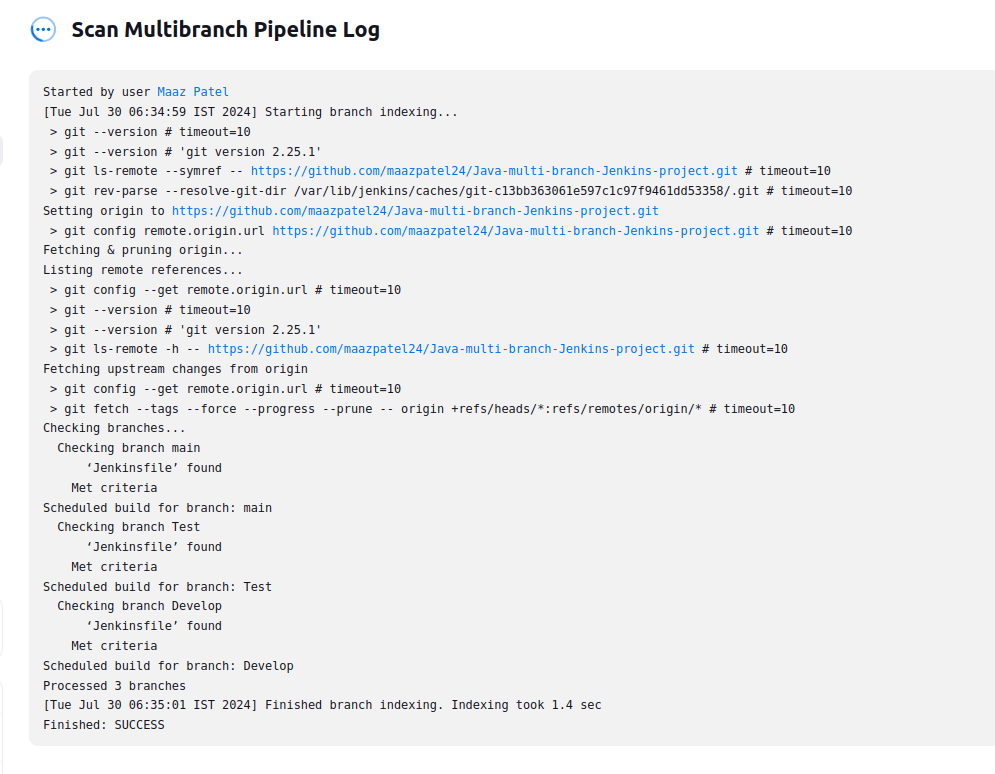
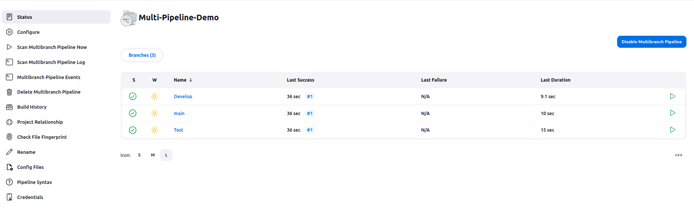
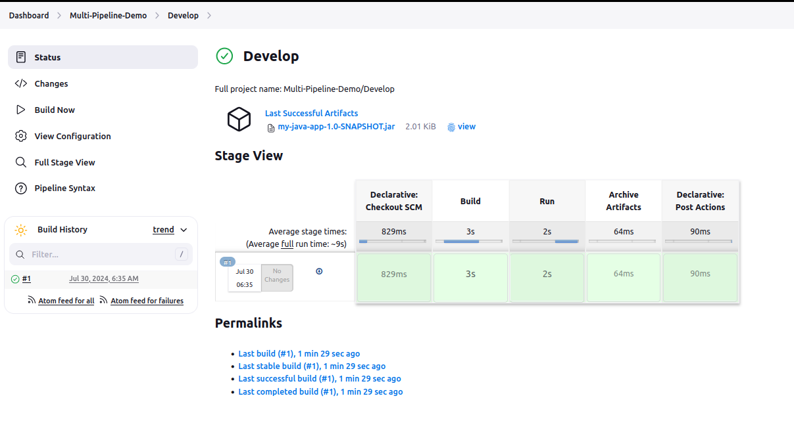

Jenkins Multi-Branch Project 
==============
                        
### 1. Creating Java Maven project:

+ In the folder named my-java-app, first create the **App.java** file under the path `src/main/java/com/example/` and enter the code given below
    ```
    package com.example;

    public class App {
        public static void main(String[] args) {
            System.out.println("Hello Maven!");
        }
    }
    ```

### 2. POM.xml and Jenkins file:

+ create the **pom.xml** file in the remote directory of project i.e. `my-java-app/` and copy-paste the below code in it
    ```
    <?xml version="1.0" encoding="UTF-8"?>
    <project xmlns="http://maven.apache.org/POM/4.0.0"
             xmlns:xsi="http://www.w3.org/2001/XMLSchema-instance"
             xsi:schemaLocation="http://maven.apache.org/POM/4.0.0 http://maven.apache.org/POM/4.0.0/maven-4.0.0.xsd">
        <modelVersion>4.0.0</modelVersion>
        <groupId>com.example</groupId>
        <artifactId>my-java-app</artifactId>
        <version>1.0-SNAPSHOT</version>
        <properties>
            <maven.compiler.source>1.8</maven.compiler.source>
            <maven.compiler.target>1.8</maven.compiler.target>
        </properties>
    </project>
    ```

## Create a Multi-Branch Pipeline Project

Below is a step by step process to create multi-branch pipeline in Jenkin.

### Step1: Write Jenkinsfile 

```Jenkinsfile
pipeline {
    agent any

     environment {
        MAVEN_HOME = tool 'Maven-3.9.0' // Ensure this matches your Maven tool name
    }

    stages {
        stage('Build') {
            steps {
                script {
                    // echo "Building in branch: ${env.BRANCH_NAME}"
                    withEnv(["PATH+MAVEN=${MAVEN_HOME}/bin"]) {
                        // Clean and compile the Maven project
                        sh 'mvn clean package'
                    }
                }
            }
        }
        stage('Run') {
            steps {
                script {
                    // echo "Building in branch: ${env.BRANCH_NAME}"
                    withEnv(["PATH+MAVEN=${MAVEN_HOME}/bin"]) {
                        sh 'mvn exec:java -Dexec.mainClass="com.example.App"'
                    }
                }
            }
        }
        stage('Archive Artifacts') {
            steps {
                // Archive the built artifacts
                archiveArtifacts artifacts: 'target/*.jar', allowEmptyArchive: true
            }
        }
    }

    post {
        always {
            echo 'Pipeline finished.'
            // Clean up workspace
            cleanWs()
        }
        success {
            echo 'Pipeline succeeded.'
        }
        failure {
            echo 'Pipeline failed.'
        }
    }
}
```


### Step2: Login to Jenkins

To create a Jenkins Pipeline project, log on to your Jenkins dashboard by visiting your Jenkins installation path. Usually, it will be hosted on localhost at http://localhost:8080 If you have installed Jenkins in another path, use the appropriate URL to access your dashboard as shown in the below Jenkins job creation example.

<p align="center"><p>


### Step3: Create New Item

Click on “New Item” at the top left-hand side of your dashboard.

<p align="center"><p>


### Step4: Enter Item Details

In the next screen,

1. Enter the name of the item you want to create. We shall use the “Multi-Pipeline-Demo” for this demo.
2. Select Multibranch Pipeline
3. Click Okay

<p align="center"><p>

### Step5: Enter Pipeline Configuration

1. Select "Pipeline script from SCM" under Pipeline Definition.
2. Select "Git" in SCM field.
3. Enter git repository  https://github.com/maazpatel24/Java-multi-branch-Jenkins-project.git
4. Select proper credentials to access *Private repository*

**Note: Jenkinsfile should be present in the repository.**

<p align="center"><p>

### Step6: Save the Project

When you have entered all the data,

Click Apply
Save the project.


### Step7: Build Source code

After saving jenkins will start building the code by checking the github repo we provided and searches for all the other branches on the repo.

<p align="center"><p>


### Step8: Multibranch Overview

After scanning every branch on the provided github repo it will run every branch as an individual jenkins project as it will find the jenkins file in each branch and after completing it will look like this



In Each branch-jenkins project i.e. in Develop/main/test we can check the logs and stage view of each job as shown below


