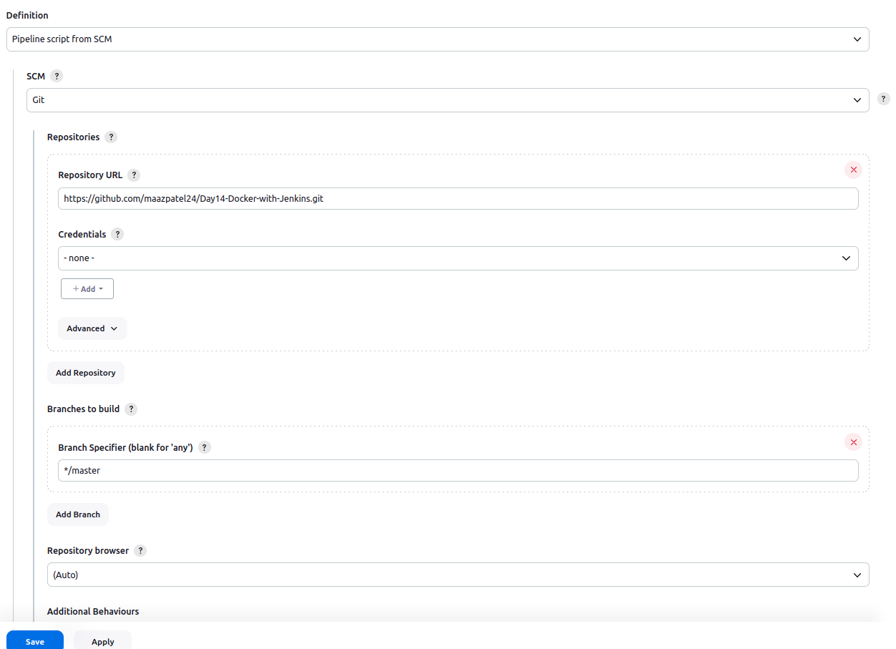

Jenkins Docker Project
===========

## Problem Statement:
+ You are tasked with setting up a CI/CD pipeline using Jenkins to streamline the deployment process of a simple Java application. The pipeline should accomplish the following tasks:
    1. **Fetch the Dockerfile:** The pipeline should clone a GitHub repository containing the source code of the Java application and a Dockerfile.
    2. **Create a Docker Image:** The pipeline should build a Docker image from the fetched Dockerfile.
    3. **Push the Docker Image:** The pipeline should push the created Docker image to a specified DockerHub repository.
    4. **Deploy the Container:** The pipeline should deploy a container using the pushed Docker image.

## Step 1: Create Git Repository: 
+ Create on folder with the project name `Docker-java-app` and create one **Sample.java, Dockerfile & Jenkinsfile** file use
    ```
    mkdir Docker-java-app
    cd Docker-java-app
    touch Sample.java Dockerfile Jenkinsfile
    ```

+ Now initiate the git repo and push the repo to the github after commiting the above created files
    ```
    git init
    git add .
    git commit -m "Initial commit: added Dockerfile, jenkinsfile and Sample.java file"
    git remote add origin https://github.com/your-username/repository-name.git
    git push -u origin master
    ```
+ Open the Sample.java file and paste the below code which just prints the value from 1 to 10
    ```
    public class Sample {
        public static void main(String[] args) {

            for(int i=1; i<=10;i++){

                System.out.println(i);
            }

        }
    }
    ```

## Step 2: Create Dockerfile and Jenkinsfile: 
+ Open the Dockerfile and paste the below lines of code in it. the below code simply used to build the image which then uses openjdk image as a base image then copy the Sample.java file at the `/usr/src/myapp` then goes to the Working Dir and compile and runs the Sample.java file 
    ```
    FROM openjdk:11
    COPY Sample.java /usr/src/myapp
    WORKDIR /usr/src/myapp
    RUN javac Sample.java
    CMD ["java", "Sample"]
    ```

+ Now open the Jenkinsfile and paste the below code
    ```
    pipeline {
        agent any
        environment {
            imageName = 'maazpatel24/day14-javaapp'
            tag = 'v1.0'
            dockerImage = ''
            containerName = 'my-day14-javaApp'
            dockerHubCredentials = 'maazpatel24-docker'
        }

        stages {
            stage ('Checkout') {
                steps {
                    git url: 'https://github.com/maazpatel24/Day14-Docker-with-Jenkins.git', branch: 'master'
                }
            }
            stage ('Build Docker Image') {
                steps {
                    script {
                        dockerImage = docker.build"${imageName}:${tag}"
                    }
                }
            }
            stage ('Push Docker Image') {
                steps {
                    script {
                        docker.withRegistry('', dockerHubCredentials) {
                            dockerImage.push()
                        }
                    }
                }
            }
            stage ('Deploy Container') {
                steps {
                    script {
                        sh "docker run -d -p 5051:80 --name ${containerName} ${imageName}:${tag}"
                    }
                }
            }

        }
        post {
            success {
                echo 'Build and test succeeded!'
            }
            failure {
                echo 'Build or test failed!'
            }
        }
    }
    ```

+ Now push the Changes to the Github repo after commiting the changes locally
    ```
    git commit -am "changing the Dockerfile and Jenkinsfile"
    git push origin master
    ```

## Step 3: Create Jenkins Project:
+ **Pre-Requisites:**
    - Install Docker Pipeline Plugin
    - Add DockerHub Credentials in Jenkins Credentials

+ Go to Jenkins dashboard and click on "New Item" <br>
<p align="center"><p>

+ Create new pipeline job and give the name `Day-14-Pipeline` and click on OK
<p align="center"><p>

+ Now provide the github repo under the Pipeline Section and choose SCM as git while configuring the Day-14-Pipeline job and provide the credentials if repo is private then click on `SAVE`


## Step 4: Build Project:
+ After configuring the Day-14-Pipeline job click on `Build Now` to run the build


+ In the console Output of '#1' build we will be able to see the logs


+ After successfully building the Job the dashboard will look like this
