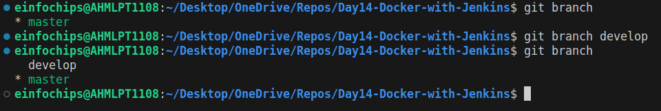
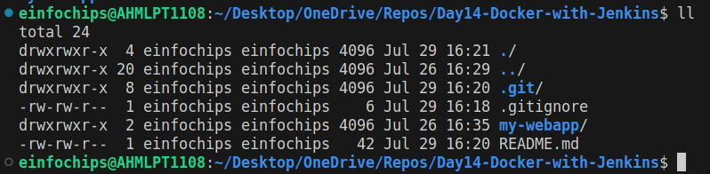
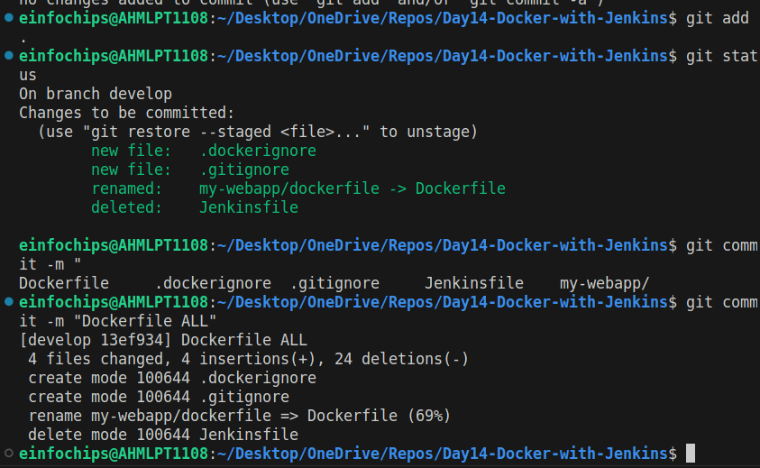
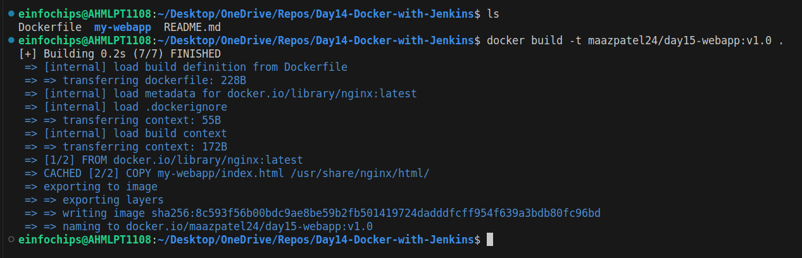
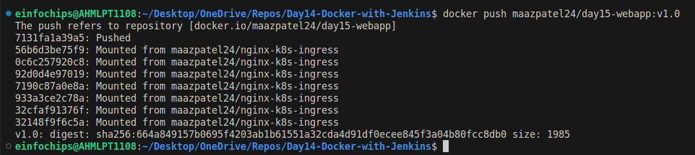

# Project Problem Statement
A development team needs to establish a basic CI/CD pipeline for a web application. The goal is to automate version control, containerization, building, testing, and deployment processes.

# Deliverables
## Git Repository:
- Create a Git repository: Initialize a new repository for the web application.
- Branching Strategy:
    + Set up main and develop branches.
    + Create a feature branch for a new feature or bug fix.
    
- Add Configuration Files:
    + Create a .gitignore file to exclude files like logs, temporary files, etc.
    + Create a README.md file with a project description, setup instructions, and contribution guidelines.
    
## Docker Configuration:
- Dockerfile:
    + Write a Dockerfile to define how to build the Docker image for the web application.
    ```
    # Use the official Nginx base image
    FROM nginx:latest

    # Copy the custom HTML file to the appropriate location 
    COPY my-webapp/index.html /usr/share/nginx/html/

    # Expose port 80 
    EXPOSE 80
    ```
- Docker Ignore File:
    + Create a .dockerignore file to exclude files and directories from the Docker build context.
    
- Image Management:
    + Build a Docker image using the Dockerfile.
    
    + Push the built Docker image to a container registry (e.g., Docker Hub).
    
## Jenkins Configuration:
- Jenkins Job Setup:
    + Create a Jenkins job to pull code from the Git repository.
    + Configure Jenkins to build the Docker image using the Dockerfile.
    + Set up Jenkins to run tests on the Docker image.
    + Configure Jenkins to push the Docker image to the container registry after a successful build.
```
- host: all
  become: true
  vars:
    container_count: 4
    default_container_name: day15_docker
    default_container_image: maazpatel24/day15-webapp:v2.0
    default_container_command: sleep 1

  tasks:
  - name: Install aptitude
    ansible.builtin.apt: name=aptitude state=latest update_cache=true
    tags: [ pkg-installayion ]

  - name: Install required system packages
    ansible.builtin.apt: name={{ item }} update_cache=true state=latest
    loop: [ 'apt-transport-https', 'ca-certificates', 'curl', 'software-properties-common', 'python3-pip', 'virtualenv', 'python3-setuptools']
    tags: [ pkg-installayion ]

  - name: Create directory for Docker's GPG key
    ansible.builtin.file:
      path: /etc/apt/keyrings
      state: directory
      mode: '0755'
    tags: [ Docker-Installation ]

  - name: Add Docker's official GPG key
    ansible.builtin.apt_key:
      url: https://download.docker.com/linux/ubuntu/gpg
      keyring: /etc/apt/keyrings/docker.gpg
      state: present
    tags: [ Docker-Installation ]

  - name: Print architecture variables
    ansible.builtin.debug:
      msg: "Architecture: {{ ansible_architecture }}, Codename: {{ ansible_lsb.codename }}"
    tags: [ Docker-Installation ]

  - name: Add Docker repository
    ansible.builtin.apt_repository:
      repo: >-
        deb [arch={{ arch_mapping[ansible_architecture] | default(ansible_architecture) }}
        signed-by=/etc/apt/keyrings/docker.gpg]
        https://download.docker.com/linux/ubuntu {{ ansible_lsb.codename }} stable
      filename: docker
      state: present
    tags: [ Docker-Installation ]

  - name: Install Docker and related packages
    ansible.builtin.apt: name="{{ item }}" state=present update_cache=true
    loop: [ 'docker-ce', 'docker-ce-cli', 'containerd.io', 'docker-buildx-plugin', 'docker-compose-plugin' ]
    tags: [ Docker-Installation ]

  - name: Add Docker group
    ansible.builtin.group:
      name: docker
      state: present
    tags: [ Docker-configuration ]
  
  - name: Add user to Docker group
    ansible.builtin.user:
      name: "{{ ansible_user }}"
      groups: docker
      append: true
    tags: [ Docker-configuration ]

  - name: Enable and start Docker services
    ansible.builtin.systemd: name="{{ item }}" enabled=true state=started
    loop:
      - docker.service
      - containerd.service
    tags: [ Systemctl-enabled ]

  - name: Pull default Docker image
    community.docker.docker_image:
      name: "{{ default_container_image }}"
      source: pull
    tags: [ Docker-imagePull ]

  - name: Create default containers
    community.docker.docker_container:
      name: "{{ default_container_name }}{{ item }}"
      image: "{{ default_container_image }}"
      command: "{{ default_container_command }}"
      state: present
    with_sequence: count={{ container_count }}
    tags: [ Docker-containerRun ]
```
- Inventory File:
    + Create an inventory file specifying the target server(s) for deployment.
```
[web]
server01 ansible_host=3.135.205.26 ansible_user=ubuntu ansible_ssh_private_key_file=~/.ssh/ansible-worker.pem 
```