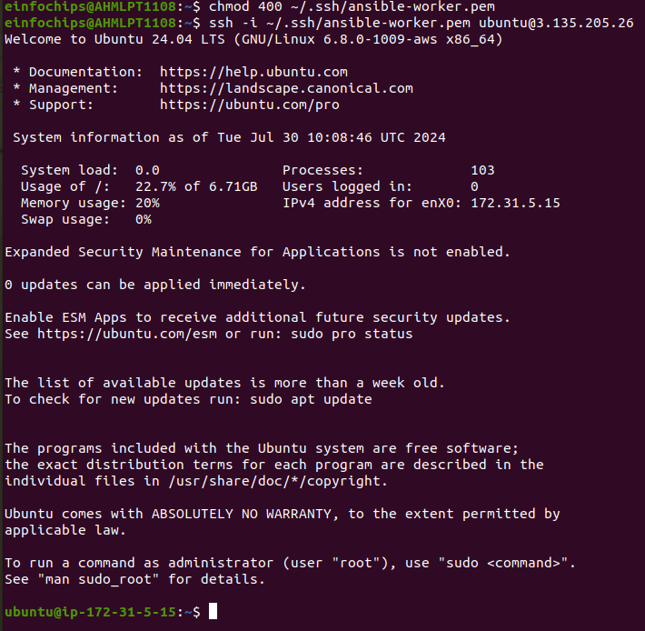
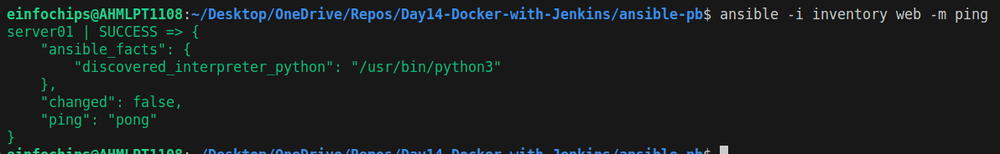
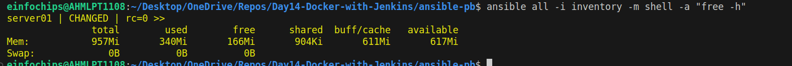
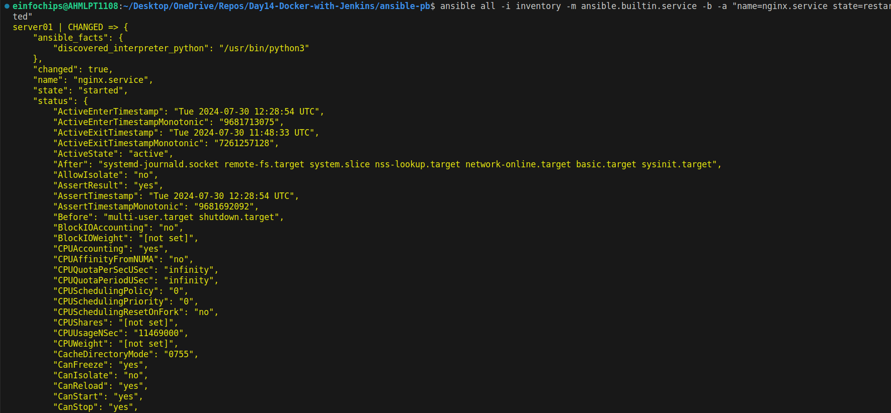
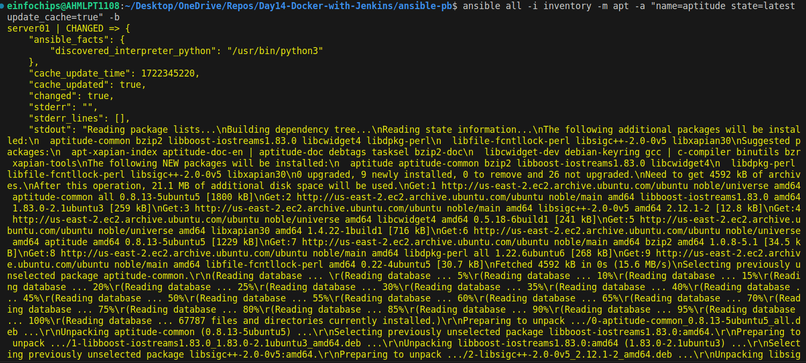
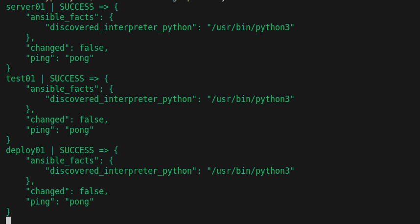
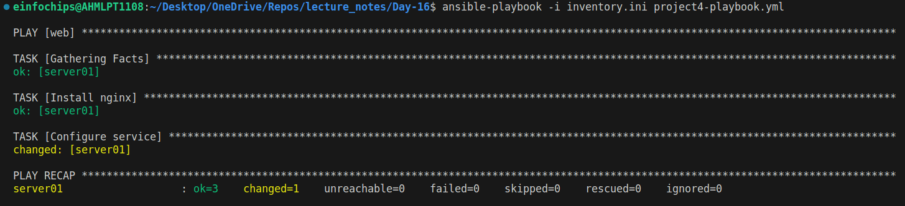
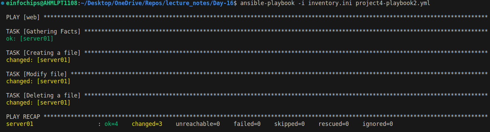
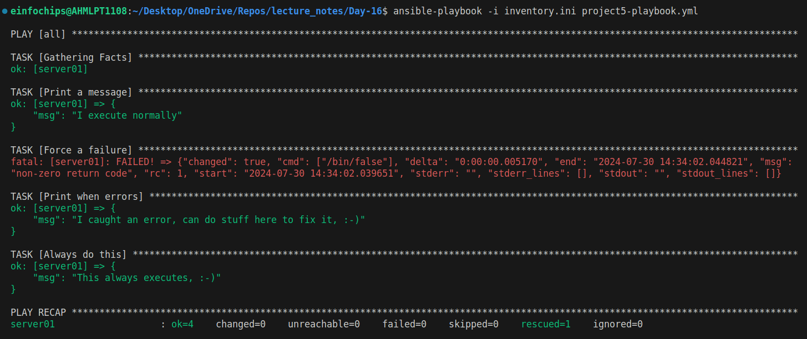

# Project 1: Deploying Ansible

## Problem Statement: 
You are tasked with deploying Ansible in a multi-node environment consisting of multiple Linux servers. The goal is to set up Ansible on a control node and configure it to manage several managed nodes. This setup will be used for automating system administration tasks across the network.

### Deliverables:
1. Control Node Setup:
    + Install Ansible on the control node.
    ```bash
    sudo apt update
    sudo apt install software-properties-common
    sudo add-apt-repository --yes --update ppa:ansible/ansible
    sudo apt install ansible
    ```
    + Configure SSH key-based authentication between the control node and managed nodes.
    ```bash
    ssh-keygen # Genterate ssh key pair
    ssh-copy-id -i <public_key_path> <username>@<publicIPaddress> # Copying public key to target server/node
    chmod 400 <private_key> # Giving read only permission to user only
    ssh -i ~/.ssh/<private_key> <username>@<publicIPaddress> # Establish ssh connection
    ```
2. Managed Nodes Configuration:
    + Ensure all managed nodes are properly configured to be controlled by Ansible.
    
    + Verify connectivity and proper setup between the control node and managed nodes.
    + Create `inventory.ini` and add the following content
    ```
    server01 ansible_host=3.135.205.26 ansible_user=ubuntu ansible_ssh_private_key_file=~/.ssh/ansible-worker.pem
    ```
    + Now using Ansible try to ping `server01`
    ```bash
    ansible -i inventory web -m ping
    ``` 
    

---
---
# Project 2: Ad-Hoc Ansible Commands

## Problem Statement: 
Your organization needs to perform frequent, one-off administrative tasks across a fleet of servers. These tasks include checking disk usage, restarting services, and updating packages. You are required to use Ansible ad-hoc commands to accomplish these tasks efficiently.

### Deliverables:
1. Task Execution:
    + Execute commands to check disk usage across all managed nodes.
    ```bash
    ansible all -i inventory -m shell -b -a "free -h"
    ```
    

    + Restart a specific service on all managed nodes.
    ```bash
    ansible all -i inventory -m ansible.builtin.service -a "name=nginx.service state=started" -b
    ```
    

    + Update all packages on a subset of managed nodes.
    ```bash
    ansible all -i inventory -m apt -a "name=aptitude state=latest update_cache=true" -b
    ```
    

2. Command Scripts:
    + Create a script or documentation for each task, detailing the ad-hoc command used and its output.

---
---

# Project 3: Working with Ansible Inventories

## Problem Statement: 
You need to manage a dynamic and diverse set of servers, which requires an organized and flexible inventory system. The project involves creating static and dynamic inventories in Ansible to categorize servers based on different attributes such as environment (development, staging, production) and roles (web servers, database servers).

### Deliverables:

1. Static Inventory:
    + Create a static inventory file with different groups for various environments and roles.
    **Example:**
    ```
    # Production Environment
    [production]
    prod-webserver.example.com ansible_host=18.216.137.227
    prod-dbserver.example.com ansible_host=18.190.160.189

    # Staging Environment
    [staging]
    staging-webserver.example.com ansible_host=3.129.67.37
    staging-dbserver.example.com 

    # Development Environment
    [development]
    dev-webserver.example.com
    dev-dbserver.example.com

    # Web Servers
    [webservers]
    prod-webserver.example.com
    staging-webserver.example.com
    dev-webserver.example.com

    # Database Servers
    [dbservers]
    prod-dbserver.example.com
    staging-dbserver.example.com
    dev-dbserver.example.com

    # Variables for different environments
    [production:vars]
    ansible_user=prod_user
    ansible_ssh_private_key_file=/path/to/prod_key

    [staging:vars]
    ansible_user=staging_user
    ansible_ssh_private_key_file=/path/to/staging_key

    [development:vars]
    ansible_user=dev_user
    ansible_ssh_private_key_file=/path/to/dev_key
    ```

    + My `inventory.ini`
    ```
    [web]
    server01 ansible_host=3.135.205.26 ansible_user=ubuntu ansible_ssh_private_key_file=~/.ssh/ansible-worker.pem 

    [webserver]
    test01 ansible_host=3.129.67.37
    test02 ansible_host=3.16.78.37 
    
    [dbserver]
    db01 ansible_host=18.216.137.227 

    [deployment]
    deploy01 ansible_host=18.190.160.189 

    [production:children]
    webserver
    dbserver
    deployment

    [deployment:vars]
    ansible_user=ubuntu
    ansible_ssh_private_key_file=~/.ssh/ansible-worker.pem

    [webserver:vars]
    ansible_user=ubuntu
    ansible_ssh_private_key_file=~/.ssh/ansible-worker.pem

    [dbserver:vars]
    ansible_user=ubuntu
    ansible_ssh_private_key_file=~/.ssh/ansible-worker.pem
    ```
    + Verify that the inventory is correctly structured and accessible by Ansible.


2. Dynamic Inventory:
    + Implement a dynamic inventory script or use a dynamic inventory plugin.
    + Configure the dynamic inventory to categorize servers automatically based on predefined criteria.

---
---
# Project 4: Ansible Playbooks: The Basics

## Problem Statement: 

Your team needs to automate repetitive tasks such as installing packages, configuring services, and managing files on multiple servers. The project involves writing basic Ansible playbooks to automate these tasks, ensuring consistency and efficiency in the operations.

### Deliverables:

1. Playbook Creation:
    + Write a playbook to install a specific package on all managed nodes.
    ```
    ---
    - hosts: web
      become: true
      tasks:
      - name: Install nginx
        ansible.builtin.apt:
          name: nginx
          update_cache: true
          state: present
    ```
    + Create a playbook to configure a service with specific parameters.

    ```
    ---
    - hosts: web
      become: true
      tasks:
      - name: Install nginx
        ansible.builtin.apt:
          name: nginx
          update_cache: true
          state: present
    
      - name: Configure service 
        ansible.builtin.copy:
          src: ./html/index.html
          dest: /var/www/html/index.html
    ```
    

    + Develop a playbook to manage files, such as creating, deleting, and modifying files on managed nodes.

    ```
    ---
    - hosts: web
      become: true
      tasks: 
      - name: Creating a file
        file:
          path: index.html
          state: touch
      - name: Modify file
        lineinfile:
          path: index.html
          line: Nginx is running from {{ansible_host}} server
      - name: Deleting a file
        file:
          path: index.html
          state: absent
    ```
    


---
---

# Project 5: Ansible Playbooks - Error Handling

## Problem Statement: 
In a complex IT environment, tasks automated by Ansible playbooks may encounter errors due to various reasons such as incorrect configurations, unavailable resources, or network issues. The project focuses on implementing error handling in Ansible playbooks to ensure resilience and proper reporting of issues.

### Deliverables:

1. Playbook with Error Handling:
    + Write a playbook that includes tasks likely to fail, such as starting a non-existent service or accessing a non-existent file.
    + Implement error handling strategies using modules like block, rescue, and always.
    ```
    ---
    - hosts: all
      tasks:
      - name: Handle the error
        block:
          - name: Print a message
            ansible.builtin.debug:
              msg: 'I execute normally'

          - name: Force a failure
            ansible.builtin.command: /bin/false

          - name: Never print this
            ansible.builtin.debug:
              msg: 'I never execute, due to the above task failing, :-('
        rescue:
          - name: Print when errors
            ansible.builtin.debug:
              msg: 'I caught an error, can do stuff here to fix it, :-)'
        always:
           - name: Always do this
             ansible.builtin.debug:
               msg: "This always executes, :-)"
    ```
    

2. Logging and Notifications:
    + Configure the playbook to log errors and notify administrators of any issues encountered during execution.
    + Use Ansible modules to send notifications via email or other communication channels.


