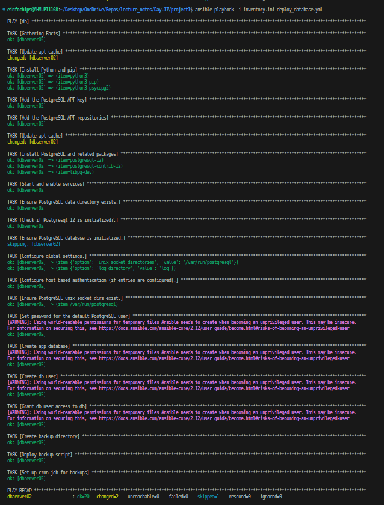

# Project 01 
## Deploy a Database Server with Backup Automation

**Objective:** Automate the deployment and configuration of a PostgreSQL database server on an Ubuntu instance hosted on AWS, and set up regular backups.

## Problem Statement

**Objective:** Automate the deployment, configuration, and backup of a PostgreSQL database server on an Ubuntu instance using Ansible.

**Requirements:**

1. AWS Ubuntu Instance: You have an Ubuntu server instance running on AWS.

2. Database Server Deployment: Deploy and configure PostgreSQL on the Ubuntu instance.

3. Database Initialization: Create a database and a user with specific permissions.

4. Backup Automation: Set up a cron job for regular database backups and ensure that backups are stored in a specified directory.

5. Configuration Management: Use Ansible to handle the deployment and configuration, including managing sensitive data like database passwords.

**Deliverables:**

1. Ansible Inventory File
    + Filename: [inventory.ini](project1/inventory.ini)
    + Content: Defines the AWS Ubuntu instance and connection details for Ansible.
    ```ini
    [db]
    dbserver01 ansible_host=<pubic_ip> ansible_user=<username> ansible_ssh_private_key_file=<private_key_file>
    ```

2. Ansible Playbook
    + Filename: [deploy_database.yml](project1/deploy_database.yml)
    + Content: Automates the installation of PostgreSQL, sets up the database, creates a user, and configures a cron job for backups. It also includes variables for database configuration and backup settings.
    ```yml
    - hosts: db
      become: yes
    # sudo -u postgres psql
      vars:

        postgresql_version: 12
        postgresql_user: postgres
        postgresql_group: postgres
        postgresql_packages:
          - postgresql-{{ postgresql_version }}
          - postgresql-contrib-{{ postgresql_version }}
          - libpq-dev

        postgresql_hba_entries:
          - {type: local, database: all, user: postgres, auth_method: peer}
          - {type: local, database: all, user: all, auth_method: md5}
          - {type: host, database: all, user: all, address: '127.0.0.1/32', auth_method: md5}
          - {type: host, database: all, user: all, address: '::1/128', auth_method: md5}
          - {type: local, database: replication, user: all, auth_method: peer}
          - {type: host, database: replication, user: all, address: '127.0.0.1/32', auth_method: md5}
          - {type: host, database: replication, user: all, address: '::1/128', auth_method: md5}
          # - {type: host, database: "{{ db_name }}", user: "{{ db_user }}", address: '0.0.0.0/0', auth_method: md5} # unsecured
        postgresql_data_dir: "/var/lib/postgresql/{{ postgresql_version }}/main"
        postgresql_bin_setup: "/usr/lib/postgresql/{{ postgresql_version }}/bin/pg_isready"
        postgresql_bin_path: "/usr/lib/postgresql/{{ postgresql_version }}/bin"
        postgresql_config_path: "/etc/postgresql/{{ postgresql_version }}/main"

        db_user: eic
        db_password: eic
        db_name: database1
        postgres_password: password
        postgresql_unix_socket_directories:
          - /var/run/postgresql
        postgresql_global_config_options:
          - option: unix_socket_directories
            value: '{{ postgresql_unix_socket_directories | join(",") }}'
          - option: log_directory
            value: 'log'
        backup_dir: /var/backups/postgresql

      tasks:
    # PSQL Installtion
        - name: Update apt cache
          ansible.builtin.apt: 
            update_cache: yes 

        - name: Install Python and pip
          ansible.builtin.apt:
            name: "{{ item }}"
            state: present
          loop:
            - python3
            - python3-pip
            - python3-psycopg2

        - name: Add the PostgreSQL APT key
          ansible.builtin.apt_key:
            url: https://www.postgresql.org/media/keys/ACCC4CF8.asc
            state: present

        - name: Add the PostgreSQL APT repositories
          ansible.builtin.apt_repository:
            repo: deb http://apt.postgresql.org/pub/repos/apt/ {{ ansible_distribution_release }}-pgdg main
            state: present

        - name: Update apt cache
          ansible.builtin.apt: 
            update_cache: yes 

        - name: Install PostgreSQL and related packages
          ansible.builtin.apt:
            name: "{{ item }}"
            state: present
          with_items: "{{ postgresql_packages }}"

        - name: "Start and enable services"
          ansible.builtin.service:
            name: postgresql
            state: started
            enabled: yes

    #----------------------------------------------------
    # Initialization

        - name: Ensure PostgreSQL data directory exists.
          file:
            path: "{{ postgresql_data_dir }}"
            owner: "{{ postgresql_user }}"
            group: "{{ postgresql_group }}"
            state: directory
            mode: 0700

        - name: Check if Postgresql {{ postgresql_version }} is initialized?.
          ansible.builtin.stat:
            path: "{{ postgresql_data_dir }}/PG_VERSION"
          register: pgdata_version

        - name: "msg"
          ansible.builtin.debug:
            msg: "{{ pgdata_version }}"

        # - name: Ensure PostgreSQL {{ postgresql_version }} database is initialized.
        #   ansible.builtin.command: "{{ postgresql_bin_setup }}"
        #   become: yes
        #   when: not pgdata_version.stat.exists
        #   notify: restart postgresql

        - name: Ensure PostgreSQL database is initialized.
          ansible.builtin.command: "{{ postgresql_bin_path }}/initdb -D {{ postgresql_data_dir }}"
          when: not pgdata_version.stat.exists
          become: yes
          become_user: "{{ postgresql_user }}"

    #----------------------------------------------------
    # Configuration Steps

        - name: Configure global settings.
          lineinfile:
            dest: "{{ postgresql_config_path }}/postgresql.conf"
            regexp: "^#?{{ item.option }}.+$"
            line: "{{ item.option }} = '{{ item.value }}'"
            state: "{{ item.state | default('present') }}"
            mode: 0644
          with_items: "{{ postgresql_global_config_options }}"
          notify: restart postgresql

        - name: Configure host based authentication (if entries are configured).
          template:
            src: "pg_hba.conf.j2"
            dest: "{{ postgresql_config_path }}/pg_hba.conf"
            owner: "{{ postgresql_user }}"
            group: "{{ postgresql_group }}"
            mode: 0600
          notify: restart postgresql
          when: postgresql_hba_entries | length > 0
          become: yes

        - name: Ensure PostgreSQL unix socket dirs exist.
          file:
            path: "{{ item }}"
            state: directory
            owner: "{{ postgresql_user }}"
            group: "{{ postgresql_user }}"
            mode: 0755
          with_items: "{{ postgresql_unix_socket_directories }}"

    #----------------------------------------------------
    # User and Database creation

        - name: Set password for the default PostgreSQL user
          community.postgresql.postgresql_user:
            name: postgres
            password: "{{ postgres_password }}"
          become: yes
          become_user: postgres

        - name: "Create app database"
          community.postgresql.postgresql_db:
            state: present
            name: "{{ db_name }}"
          become: yes
          become_user: postgres

        - name: "Create db user"
          community.postgresql.postgresql_user:
            state: present
            name: "{{ db_user }}"
            password: "{{ db_password }}"
          become: yes
          become_user: postgres

        - name: "Grant db user access to db"
          community.postgresql.postgresql_privs:
            type: database
            database: "{{ db_name }}"
            roles: "{{ db_user }}"
            grant_option: no
            privs: all
          become: yes
          become_user: postgres

    #----------------------------------------------------
    # Backup Script

        - name: Create backup directory
          ansible.builtin.file:
            path: "{{ backup_dir }}"
            state: directory
            owner: postgres
            group: postgres
            mode: '0755'

        - name: Deploy backup script
          ansible.builtin.copy:
            src: scripts/backup.sh
            dest: "{{ backup_dir }}/backup.sh"
            mode: '0755'

        - name: Set up cron job for backups
          ansible.builtin.cron:

            name: "PostgreSQL Backup"
            user: postgres
            job: "{{ backup_dir }}/backup.sh {{ db_name }} {{ db_user }} {{ db_password }} {{ backup_dir }}"
            minute: "0"
            hour: "2"
            state: present

    #----------------------------------------------------

      handlers:
      - name: restart postgresql
        ansible.builtin.service:
          name: postgresql
          state: restarted
    ```
    + Also create [ansible.cfg](project1/ansible.cfg)
    ```cfg
    [defaults]
    allow_world_readable_tmpfiles: true
    ```

3. Jinja2 Template
    + Filename: [templates/pg_hba.conf.j2](project1/templates)
    + Content: Defines the PostgreSQL configuration file (pg_hba.conf) using Jinja2 templates to manage access controls dynamically.
    ```j2
    # PostgreSQL Client Authentication Configuration File
    # ===================================================

    
    {{ client.type }} {{ client.database }} {{ client.user }} {{ client.address|default('') }} {{ client.ip_address|default('') }} {{ client.ip_mask|default('') }} {{ client.auth_method }} {{ client.auth_options|default("") }}
    
    ```

4. Backup Script
    + Filename: [scripts/backup.sh](project1/scripts/backup.sh)
    + Content: A script to perform the backup of the PostgreSQL database. This script should be referenced in the cron job defined in the playbook.
    ```sh
    #!/bin/bash

    # Backup script for PostgreSQL database
    
    # Variables
    DB_NAME=$1
    DB_USER=$2
    DB_PASS=$3
    BACKUP_DIR=$4
    TIMESTAMP=$(date +"%F")
    BACKUP_FILE=$BACKUP_DIR/$DB_NAME-$TIMESTAMP/backup.log

    mkdir -p $BACKUP_DIR/$DB_NAME-$TIMESTAMP

    # Create a backup
    PGPASSWORD="$DB_PASS" pg_dump -U "$DB_USER" "$DB_NAME" > "$BACKUP_FILE"
    ```

## Console Output



---

# Project 02

**Objective:** Automate the setup of a multi-tier web application stack with separate database and application servers using Ansible.

## Problem Statement

Objective: Automate the deployment and configuration of a multi-tier web application stack consisting of:

1. Database Server: Set up a PostgreSQL/MySQL database server on one Ubuntu instance.

2. Application Server: Set up a web server (e.g., Apache or Nginx) on another Ubuntu instance to host a web application.

3. Application Deployment: Ensure the web application is deployed on the application server and is configured to connect to the PostgreSQL database on the database server.

4. Configuration Management: Use Ansible to automate the configuration of both servers, including the initialization of the database and the deployment of the web application.

**Deliverables**

1. Ansible Inventory File
    + Filename: [inventory.ini](project2/inventory.ini)
    + Content: Defines the database server and application server instances, including their IP addresses and connection details.
    ```ini
    [web]
    webserver01 ansible_host=<pubic_ip> ansible_user=<username> ansible_ssh_private_key_file=<private_key_file>
    [db]
    dbserver01 ansible_host=<pubic_ip> ansible_user=<username> ansible_ssh_private_key_file=<private_key_file>
    ```

2. Ansible Playbook
    + Filename: [deploy_multitier_stack.yml](project2/deploy_multitier_stack.yml)
    + Content: Automates:
        + The deployment and configuration of the PostgreSQL/MySQL database server.
        + The setup and configuration of the web server.
        + The deployment of the web application and its configuration to connect to the database.
    ```yml
    ---
    - hosts: all
      become: yes

      vars:
        #MySQL Settings
        mysql_root_password: "mysql_root_password"
        mysql_db: "my_db"
        mysql_user: "maaz"
        mysql_password: "password"

        #HTTP Settings
        http_host: "mysite.com"
        http_conf: "mysite.conf"
        http_port: "80"

      tasks:
        - name: Install prerequisites
          apt: name=aptitude update_cache=yes state=latest force_apt_get=yes
          tags: [ packages ]

        - name: Install Apache web server
          apt:
            name: apache2
            update_cache: yes
            state: latest
          tags: [ packages ]

        - name: Create Document root
          file:
            path: "/var/www/html/{{ http_host }}"
            state: directory
            owner: "www-data"
            group: "www-data"
            mode: '0755'
          tags: [ apache ]

        - name: Deploy Application files
          copy:
            src: files/index.html
            dest: "/var/www/html/{{ http_host }}/index.html"
          tags: [ apache ]

        - name: Set up Apache VirtualHost
          template:
            src: "templates/app_config.php.j2"
            dest: "/etc/apache2/sites-available/{{ http_conf }}"
          notify: Reload Apache
          tags: [ apache ]

        - name: Enable rewrite module
          shell: /usr/sbin/a2enmod rewrite
          notify: Reload Apache
          tags: [ apache ]

        - name: Enable new site
          shell: /usr/sbin/a2ensite {{ http_conf }}
          notify: Reload Apache
          tags: [ apache ]

        - name: Disable default Apache site
          shell: /usr/sbin/a2dissite 000-default.conf
          notify: Restart Apache
          tags: [ apache ]

        - name: Install MySQL Packages
          apt: name={{ item }} update_cache=yes state=latest
          loop: [ 'mysql-server', 'python3-pymysql']
          tags: [ packages ]

        - name: Set the root password
          mysql_user:
            name: root
            password: "{{ mysql_root_password }}"
            login_unix_socket: /var/run/mysqld/mysqld.sock
          tags: [ mysql, mysql-root ]

        - name: Remove all anonymous user accounts
          mysql_user:
            name: ''
            host_all: yes
            state: absent
            login_user: root
            login_password: "{{ mysql_root_password }}"
          tags: [ mysql ]

        - name: Remove the MySQL test database
          mysql_db:
            name: test
            state: absent
            login_user: root
            login_password: "{{ mysql_root_password }}"
          tags: [ mysql ]

        - name: Creates database 
          mysql_db:
            name: "{{ mysql_db }}"
            state: present
            login_user: root
            login_password: "{{ mysql_root_password }}"
          tags: [ mysql ]

        - name: Create MySQL user
          mysql_user:
            name: "{{ mysql_user }}"
            password: "{{ mysql_password }}"
            priv: "{{ mysql_db }}.*:ALL"
            state: present
            login_user: root
            login_password: "{{ mysql_root_password }}"
          tags: [ mysql ]

      handlers:
          - name: Reload Apache
            service:
              name: apache2
              state: reloaded

          - name: Restart Apache
            service:
              name: apache2
              state: restarted
    ```

3. Jinja2 Template
    + Filename: [templates/app_config.php.j2](project2/templates/app_config.php.j2)
    + Content: Defines a configuration file for the web application that includes placeholders for dynamic values such as database connection details.
    ```j2
    <VirtualHost *:{{ http_port }}>
       ServerAdmin webmaster@localhost
       ServerName {{ http_host }}
       ServerAlias www.{{ http_host }}
       DocumentRoot /var/www/html/{{ http_host }}
       ErrorLog ${APACHE_LOG_DIR}/error.log
       CustomLog ${APACHE_LOG_DIR}/access.log combined

       <Directory /var/www/html/{{ http_host }}>
             AllowOverride All
       </Directory>

    </VirtualHost>
    ```

4. Application Files
    + Filename: [files/index.html](project2/files/index.html) (or equivalent application files)
    + Content: Static or basic dynamic content served by the web application.
    ```html
    <!DOCTYPE html> 
    <html> 
    <body> 
        <center><h1>Hello from My Web App!</h1></center>
    </body> 
    </html> 
    ```

## Console Output


## Web Application
