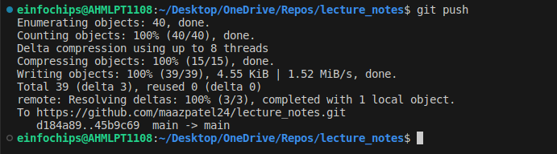
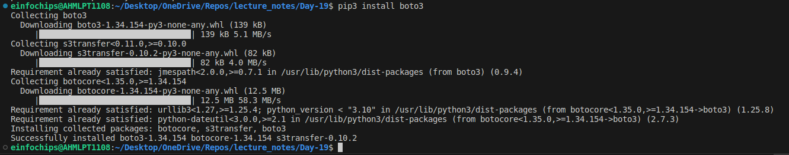
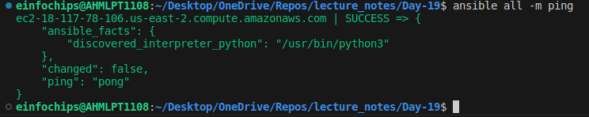
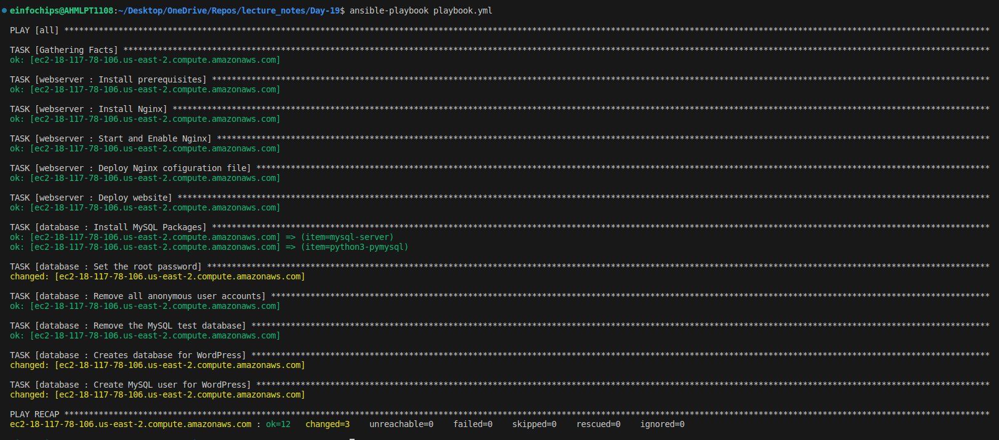
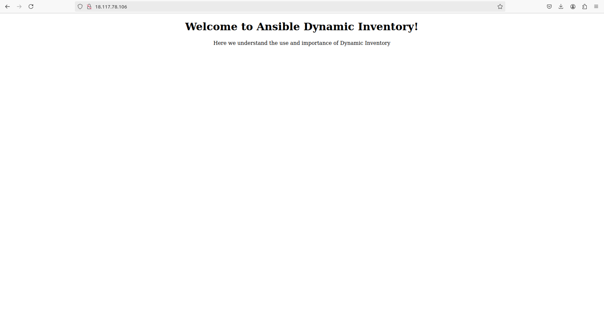

# Project Overview

In this capstone project, you will create a comprehensive automated deployment pipeline for a web application on an AWS EC2 instance running Ubuntu using Ansible. You will follow best practices for playbooks and roles, implement version control, document and maintain your code, break down tasks into roles, write reusable and maintainable code, and use dynamic inventory scripts. This project will culminate in a fully functional deployment, demonstrating your mastery of Ansible for infrastructure automation.

## Project Objectives
+ Set up an AWS EC2 instance as a worker node.
+ Implement Ansible playbooks and roles following best practices.
+ Use version control to manage Ansible codebase.
+ Document Ansible roles and playbooks.
+ Break down deployment tasks into reusable roles.
+ Write reusable and maintainable Ansible code.
+ Use dynamic inventory scripts to manage AWS EC2 instances.
+ Deploy a web application on the EC2 instance.

## Project Components and Milestones

EC2 Instances given will have a tag of Role: `webserver` and Name: `<Participants Name>` so you will be able to ping each other VMs.

Example:

Instance 1
Tags:
**Role:** webserver
**Name:** Maaz

## Milestone 1: Environment Setup

**Objective:** Configure your development environment and AWS infrastructure.

**Tasks:**
+ Launch an AWS EC2 instance running Ubuntu.
+ Install Ansible and Git on your local machine or control node.

+ Install `aws-cli`

    ```bash
    curl "https://awscli.amazonaws.com/awscli-exe-linux-x86_64.zip" -o "awscliv2.zip"
    unzip awscliv2.zip
    sudo ./aws/install --bin-dir /usr/local/bin --install-dir /usr/local/aws-cli --update
    ```
+ Configure aws credentials run:
    ```bash
    aws configure 
    # Will prompt to enter 
    # AWS Access Key ID [None]: 
    # AWS Secret Access Key [None]: 
    # Default region name [None]: 
    # Default output format [None]:
    ```

**Deliverables:**
+ AWS EC2 instance running Ubuntu.
+ Local or remote control node with Ansible and Git installed.

## Milestone 2: Create Ansible Role Structure

**Objective:** Organize your Ansible project using best practices for playbooks and roles.

**Tasks:**
+ Use Ansible Galaxy to create roles for web server, database, and application deployment.
    ```bash
    ansible-galaxy init roles/webserver
    ansible-galaxy init roles/database
    ansible-galaxy init roles/appDeploy
    ```
+ Define the directory structure and initialize each role.
    ```sql
    roles/
    ├── appDeploy
    │   ├── defaults
    │   │   └── main.yml
    │   ├── files
    │   ├── handlers
    │   │   └── main.yml
    │   ├── meta
    │   │   └── main.yml
    │   ├── README.md
    │   ├── tasks
    │   │   └── main.yml
    │   ├── templates
    │   ├── tests
    │   │   ├── inventory
    │   │   └── test.yml
    │   └── vars
    │       └── main.yml
    ├── database
    │   ├── defaults
    │   │   └── main.yml
    │   ├── files
    │   ├── handlers
    │   │   └── main.yml
    │   ├── meta
    │   │   └── main.yml
    │   ├── README.md
    │   ├── tasks
    │   │   └── main.yml
    │   ├── templates
    │   ├── tests
    │   │   ├── inventory
    │   │   └── test.yml
    │   └── vars
    │       └── main.yml
    └── webserver
        ├── defaults
        │   └── main.yml
        ├── files
        ├── handlers
        │   └── main.yml
        ├── meta
        │   └── main.yml
        ├── README.md
        ├── tasks
        │   └── main.yml
        ├── templates
        ├── tests
        │   ├── inventory
        │   └── test.yml
        └── vars
            └── main.yml
    ```

**Deliverables:**
+ Ansible role directories for webserver, database, and application.

## Milestone 3: Version Control with Git

**Objective:** Implement version control for your Ansible project.

**Tasks:**
+ Initialize a Git repository in your project directory.
+ Create a `.gitignore` file to exclude unnecessary files.
+ Commit and push initial codebase to a remote repository.
    ```bash
    git add .
    git commit -m "commit message"
    git push origin <branch_name>
    ```

    

**Deliverables:**
+ Git repository with initial Ansible codebase.
+ Remote repository link (e.g., GitHub).

## Milestone 4: Develop Ansible Roles

**Objective:** Write Ansible roles for web server, database, and application deployment.

**Tasks:**
+ Define tasks, handlers, files, templates, and variables within each role.
    ```bash
    # No need to manualy create roles structure, if you have created using ansible-galaxy
    mkdir -p roles/webserver/{task,handlers,files,templates,vars}
    mkdir -p roles/database/{task,handlers,files,templates,vars}
    mkdir -p roles/appDeployment/{task,handlers,files,templates,vars}
    ```
+ Ensure each role is modular and reusable.

**Deliverables:**
+ Completed Ansible roles for webserver, database, and application.

## Milestone 5: Documentation and Maintenance

**Objective:** Document your Ansible roles and playbooks for future maintenance.

**Tasks:**
+ Create README.md files for each role explaining purpose, variables, tasks, and handlers.
+ Add comments within your playbooks and roles to explain complex logic.
**Deliverables:**
+ README.md files for webserver, database, and application roles.
+ Well-documented playbooks and roles.

## Milestone 6: Dynamic Inventory Script

**Objective:** Use dynamic inventory scripts to manage AWS EC2 instances.

**Tasks:**
+ Write a Python script that queries AWS to get the list of EC2 instances.
    ```py
    #!/usr/bin/env python3

    import json
    import boto3

    def get_inventory():
        ec2 = boto3.client('ec2', region_name='us-east-2')  # Specify your region
        response = ec2.describe_instances(Filters=[{'Name': 'tag:Name', 'Values': ['Maaz']}]) #{'Name': 'tag:Name', 'Values': ['Maaz']} # Tag specific ec2 instance only

        inventory = {
            'all': {
                'hosts': [],
                'vars': {}
            },
            '_meta': {
                'hostvars': {}
            }
        }

        ssh_key_file = '~/.ssh/ansible-worker.pem'  # Path to your SSH private key file
        ssh_user = 'ubuntu'  # SSH username

        for reservation in response['Reservations']:
            for instance in reservation['Instances']:
                public_dns = instance.get('PublicDnsName', instance['InstanceId'])
                inventory['all']['hosts'].append(public_dns)
                inventory['_meta']['hostvars'][public_dns] = {
                    'ansible_host': instance.get('PublicIpAddress', instance['InstanceId']),
                    'ansible_ssh_private_key_file': ssh_key_file,
                    'ansible_user': ssh_user
                }

        return inventory

    if __name__ == '__main__':
        print(json.dumps(get_inventory()))
    ```
+ Format the output as an Ansible inventory.
+ Dynamic Inventory would only be created and use during run time. It won't create inventory file in any location of the system.
+ To get inventory as an output file `inventory.json`
    ```bash
    python3 dynamic_inventory > inventory.json
    ```
    ```json
    {
      "all": {
        "hosts": [
          "ec2-18-117-78-106.us-east-2.compute.amazonaws.com"
        ],
        "vars": {
        
        }
      },
      "_meta": {
        "hostvars": {
          "ec2-18-117-78-106.us-east-2.compute.amazonaws.com": {
            "ansible_host": "18.117.78.106",
            "ansible_ssh_private_key_file": "~/.ssh/ansible-worker.pem",
            "ansible_user": "ubuntu"
          }
        }
      }
    }
    ```
+ Before runing python script for dynamic inventory, install all required libraries.
    ```bash
    pip3 install boto3
    ```
    

+ Also configure your `ansible.cfg` to use dynamic_inventory.py as inventory file.
    ```cfg
    [defaults]
    inventory = ./dynamic_inventory.py
    ``` 

+ Ping using dynamic_inventory.py
    ```bash
    ansible all -m ping
    ```
    

**Deliverables:**
+ Dynamic inventory script to fetch EC2 instance details.

## Milestone 7: Playbook Development and Deployment

**Objective:** Create and execute an Ansible playbook to deploy the web application.

**Tasks:**
+ Develop a master playbook that includes all roles.
+ Define inventory and variable files for different environments.
+ Execute the playbook to deploy the web application on the EC2 instance.

    

+ Web App running on serever.

    

**Deliverables:**
+ Ansible playbook for web application deployment.
+ Successfully deployed web application on the EC2 instance.
