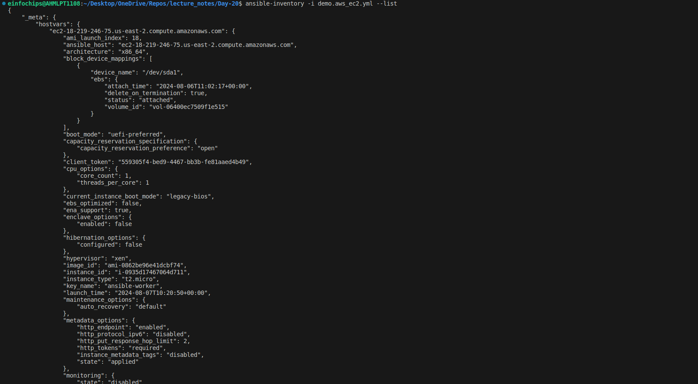
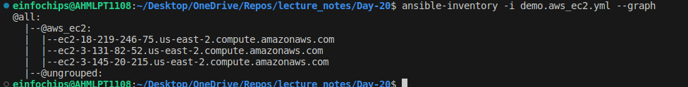
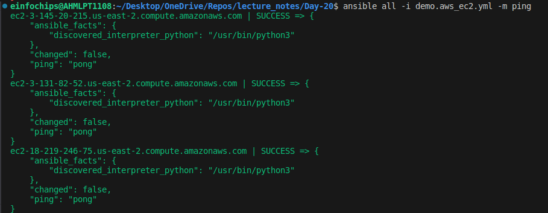
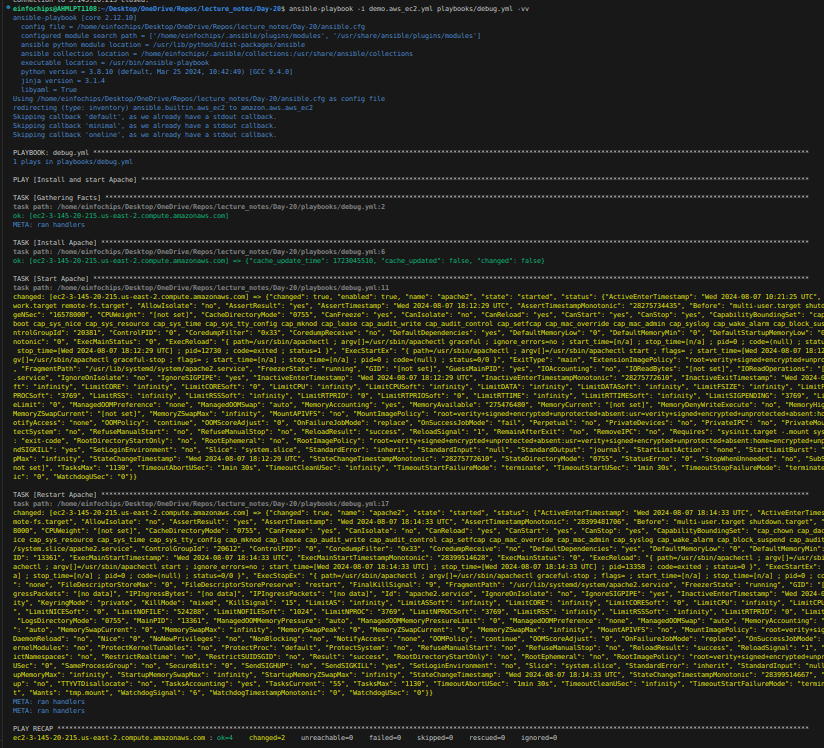

# Project 01

1. **Inventory Plugins**

    **Activity:** Configure a dynamic inventory plugin to manage a growing number of web servers dynamically. Integrate the plugin with Ansible to automatically detect and configure servers in various environments.
    
    + Inventory plugin will be need is `amazon.aws.aws_ec2`
    + To install it, use: 
    ```bash
    ansible-galaxy collection install amazon.aws
    ``` 
    + The inventory file is a YAML configuration file and must end with `aws_ec2.{yml|yaml}`. Example: `my_inventory.aws_ec2.yml`. 
    + Requirements
        
        The below requirements are needed on the local controller node that executes this inventory.   
        + python >= 3.6
        + boto3 >= 1.26.0
        + botocore >= 1.29.0

    + Configure aws credentials run:
        ```bash
        aws configure 
        # Will prompt to enter 
        # AWS Access Key ID [None]: 
        # AWS Secret Access Key [None]: 
        # Default region name [None]: 
        # Default output format [None]:
        ```
    
    + Create file `demo.aws_ec2.yml`
        ```yml
        plugin: aws_ec2
        regions:
          - us-east-2
        filters:                # fiter base on your choice
          instance-state-name:  # which every instance state is running
            - running
          tag:Name:
            - Maaz              # Instance with tag Name: Maaz
            - Vraj              # Instance with tag Name: Vraj
            - Mayusha           # Instance with tag Name: Mayusha
        hostnames:
          - dns-name
        compose:
          ansible_host: public_dns_name  # store public dns name in inventory
        ```

    + Create `ansible.cfg` file in project folder
        ```cfg
        [defaults]
        host_key_checking = false
        remote_user = ubuntu
        private_key_file = ~/.ssh/ansible-worker.pem
        ```

    + Check whether dynamic inventory is working, use:
        ```bash
        ansible-inventory -i demo.aws_ec2.yml --list
        ansible-inventory -i demo.aws_ec2.yml --graph
        ```
        

        

    + Check by using ping module
        ```bash
        ansible all -i demo.aws_ec2.yml -m ping
        ```
        


    **Deliverable:** Dynamic inventory configuration file or script, demonstrating the ability to automatically update the inventory based on real-time server data.

2. **Performance Tuning**
    
    **Activity:** Tune Ansible performance by adjusting settings such as parallel execution (forks), optimizing playbook tasks, and reducing playbook run time.

    + Adjusting the number of forks allows Ansible to run tasks in parallel across multiple hosts.

    + Configure `ansible.cfg`

        ```cfg
        [defaults]
        host_key_checking = false
        remote_user = ubuntu
        private_key_file = ~/.ssh/ansible-worker.pem

        fork = 10  # default value is 5
        ```
    
    **Deliverable:** Optimized ansible.cfg configuration file, performance benchmarks, and documentation detailing changes made for performance improvement.

3. **Debugging and Troubleshooting Playbooks**
    
    **Activity:** Implement debugging strategies to identify and resolve issues in playbooks, including setting up verbose output and advanced error handling.

    + **Verbose mode** in Ansible increases the amount of information displayed during the execution of a playbook. This is useful for debugging and understanding what Ansible is doing under the hood.
    + Usage
        + You can control the verbosity level using the `-v` flag when running your playbook. Each additional v increases the verbosity level.
        + Examples:
            + `-v`: Basic verbose (task results). (Default)
            + `-vv`: More detailed (task input/output).
            + `-vvv`: Even more detailed (task execution).
            + `-vvvv`: Maximum verbosity (Ansible internal details).
    
        ```bash
        ansible-playbook -i demo.aws_ec2.yml playbooks/debug.yml -vv
        ```
        


    **Deliverable:** Debugged playbooks with enhanced error handling and logging, including a troubleshooting guide with common issues and solutions.

4. **Exploring Advanced Modules**
    
    **Activity:** Use advanced Ansible modules such as docker_container to manage containerized applications and aws_ec2 for AWS infrastructure management, demonstrating their integration and usage.

    
    
    **Deliverable:** Playbooks showcasing the deployment and management of Docker containers and AWS EC2 instances, along with documentation on the benefits and configurations of these advanced modules.
