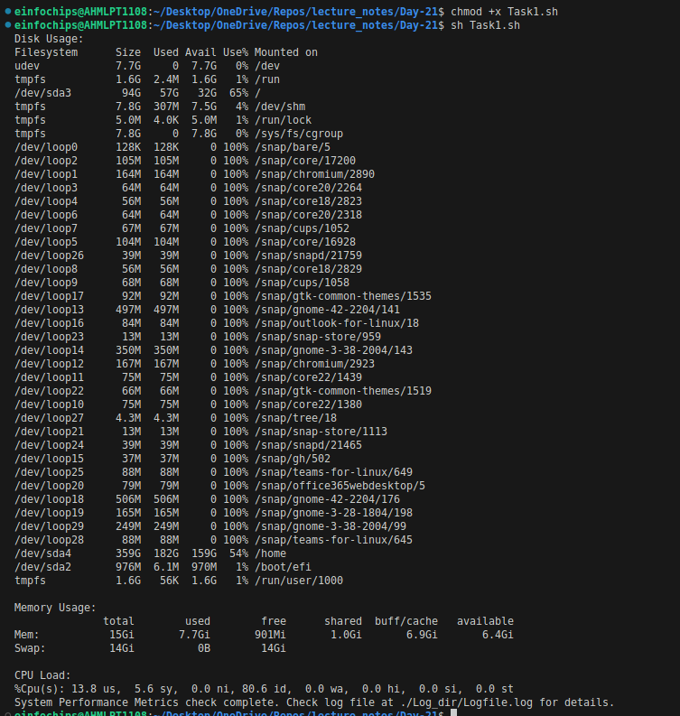
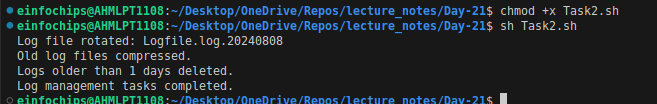
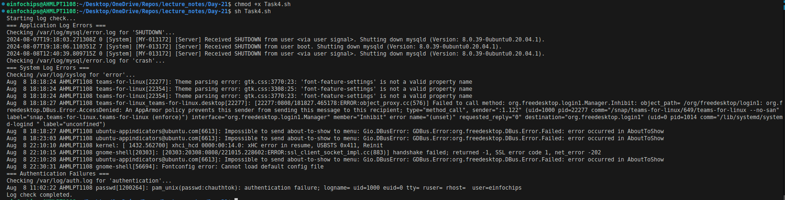
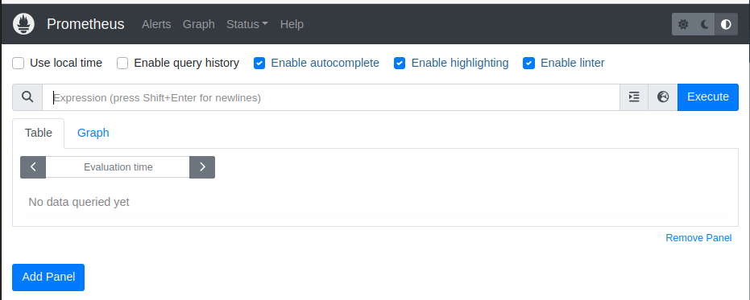
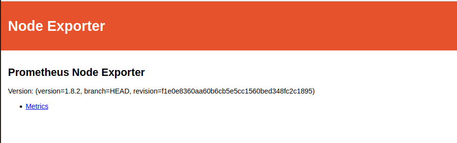
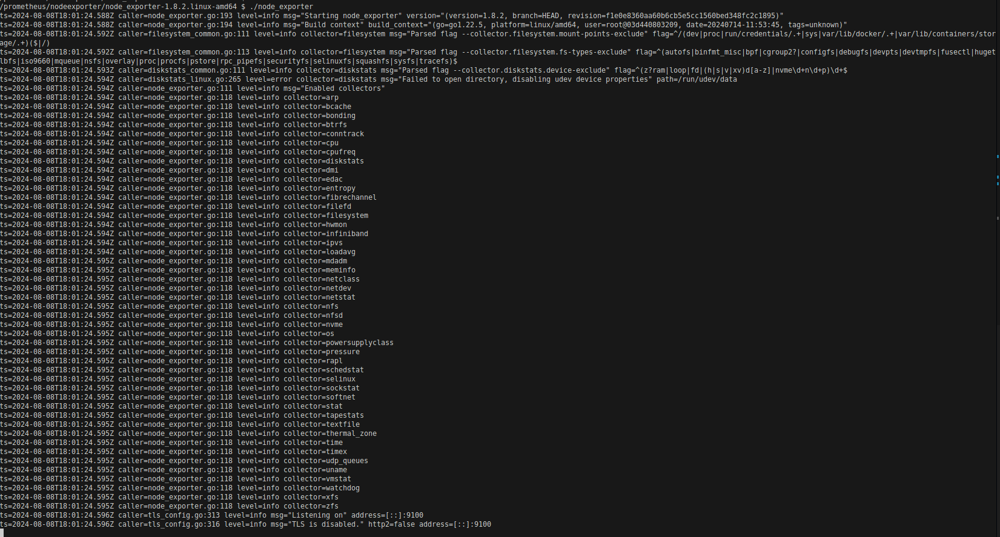
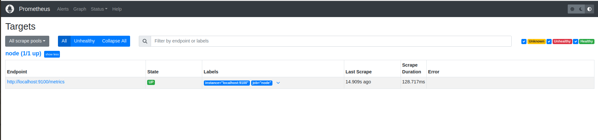
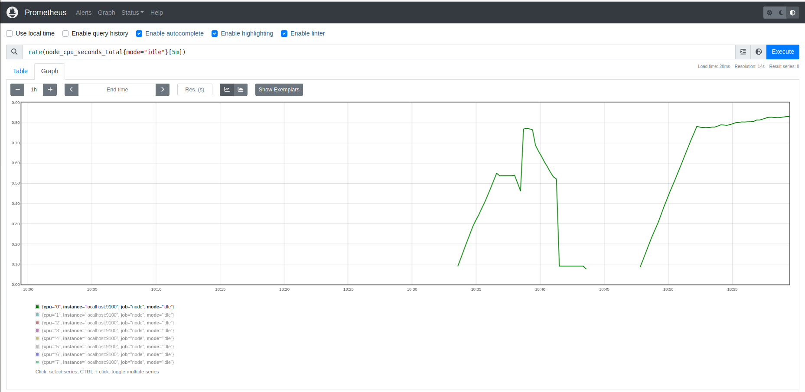
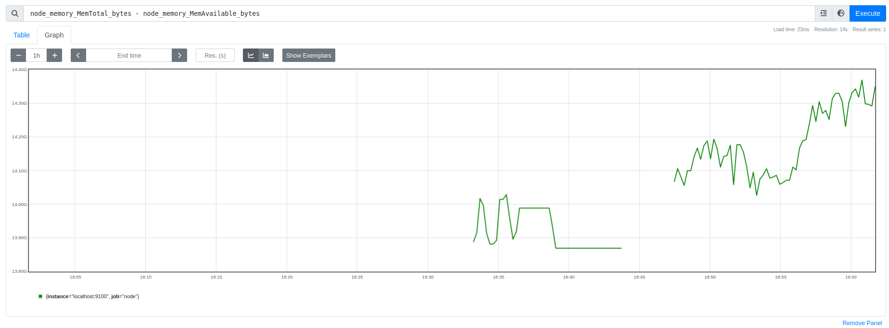

# Project 01: 

## Project Overview:

The goal of this capstone project is to combine shell scripting with system monitoring and log management practices. You will create a set of automated tools using shell scripts to manage logs, monitor system performance using Prometheus and Node Exporter, and generate insights using PromQL queries. The project will require a systematic approach, covering scripting fundamentals, log management, and monitoring setup.

## Project Deliverables:

1. Shell Scripts for Basic Operations:

    **Task:** Write shell scripts to perform basic system operations, such as checking disk usage, memory usage, and CPU load.

    ```sh
    #!/bin/bash

    LOGFILE="./Log_dir/Logfile.log"

    echo "Running System Performance Metrics Check at $(date)" >> $LOGFILE

    {
        echo "Disk Usage:"
        df -h
        echo ""

        echo "Memory Usage:"
        free -h
        echo ""

        echo "CPU Load:"
        top -b -n1 | grep "Cpu(s)"
    } 2>&1 | tee -a $LOGFILE

    echo "" >> $LOGFILE

    echo "System Performance Metrics check complete. Check log file at $LOGFILE for details."
    ```

    ```bash
    # before running the script first change the permission of Task1.sh
    chmod +x Task1.sh
    sh Task1.sh
    ```

    **Deliverable:**
    + A collection of scripts that output system performance metrics.
    + Scripts should include error handling and logging.

        


2. Log Management Script:

    **Task:** Develop a script to automate log management tasks such as log rotation and archiving. This script should include the ability to compress old logs and delete logs older than a specified number of days.

    ```sh
    #!/bin/bash

    # Configuration
    LOG_DIR="./Log_dir"       # Directory containing the logs
    ARCHIVE_DIR="./Archived_logs"  # Directory to store archived logs
    RETENTION_DAYS=1              # Number of days to retain logs
    LOGFILE="Logfile.log"            # Name of the log file to rotate

    # Ensure the archive directory exists
    mkdir -p "$ARCHIVE_DIR"

    # Get the current date
    CURRENT_DATE=$(date +'%Y%m%d')

    # Rotate the log file
    mv "$LOG_DIR/$LOGFILE" "$ARCHIVE_DIR/$LOGFILE.$CURRENT_DATE"
    echo "Log file rotated: $LOGFILE.$CURRENT_DATE"

    # Compress old log files
    find "$ARCHIVE_DIR" -type f -name "$LOGFILE.*" -not -name "*.gz" -exec gzip {} \;
    echo "Old log files compressed."

    # Delete logs older than the specified retention period
    find "$ARCHIVE_DIR" -type f -name "$LOGFILE.*.gz" -mtime +$RETENTION_DAYS -exec rm {} \;
    echo "Logs older than $RETENTION_DAYS days deleted."

    # Restart the logging service (optional)
    # service myapp restart

    echo "Log management tasks completed."

    ```

    ```bash
    # before running the script first change the permission of Task2.sh
    chmod +x Task2.sh
    sh Task2.sh
    ```

    **Deliverable:**

    + A shell script that performs log rotation based on predefined conditions (e.g., log size, log age).
    + A report generated by the script detailing which logs were rotated, compressed, or deleted.

        

3. Advanced Shell Scripting - Loops, Conditions, Functions, and Error Handling:

    **Task:** Refactor the previous scripts to include loops, conditionals, and functions for modularity. Implement error handling to manage potential issues during script execution.

    ```sh
    #!/bin/bash

    # Configuration
    LOG_DIR="./Log_dir"                     # Directory containing the logs
    ARCHIVE_DIR="./Archived_logs"           # Directory to store archived logs
    RETENTION_DAYS=1                        # Number of days to retain logs
    LOGFILE="Logfile.log"                   # Name of the log file to rotate
    MAX_LOG_SIZE=10485760                   # Maximum log file size in bytes (10MB)
    REPORT_FILE="./Reports/log_management_report.txt" # Report file

    # Ensure the archive directory exists
    mkdir -p "$ARCHIVE_DIR"

    # Create or clear the report file
    : > "$REPORT_FILE"

    echo "Log Management Report - $(date)" >> "$REPORT_FILE"
    echo "===================================" >> "$REPORT_FILE"

    # Function to check log size and rotate if necessary
    rotate_log() {
        local logfile="$1"
        if [ -f "$logfile" ]; then
            local logsize=$(stat -c%s "$logfile" 2>>"$REPORT_FILE")
            if [ $? -ne 0 ]; then
                echo "Error getting log file size: $logfile" >> "$REPORT_FILE"
                return 1
            fi

            if (( logsize > MAX_LOG_SIZE )); then
                local current_date=$(date +'%Y%m%d_%H%M%S')
                local archived_log="$ARCHIVE_DIR/$LOGFILE.$current_date"

                mv "$logfile" "$archived_log" 2>>"$REPORT_FILE"
                if [ $? -ne 0 ]; then
                    echo "Error rotating log file: $logfile" >> "$REPORT_FILE"
                    return 1
                fi

                echo "Rotated log file: $logfile to $archived_log" >> "$REPORT_FILE"

                # Compress the rotated log file
                gzip "$archived_log" 2>>"$REPORT_FILE"
                if [ $? -ne 0 ]; then
                    echo "Error compressing log file: $archived_log" >> "$REPORT_FILE"
                    return 1
                fi
                echo "Compressed log file: $archived_log.gz" >> "$REPORT_FILE"

                # Create a new log file
                touch "$logfile" 2>>"$REPORT_FILE"
                if [ $? -ne 0 ]; then
                    echo "Error creating new log file: $logfile" >> "$REPORT_FILE"
                    return 1
                fi
                echo "Created new log file: $logfile" >> "$REPORT_FILE"
            else
                echo "Log file size is within limits: $logfile (Size: $logsize bytes)" >> "$REPORT_FILE"
            fi
        else
            echo "Log file not found: $logfile" >> "$REPORT_FILE"
            return 1
        fi
        return 0
    }

    # Function to delete old logs
    delete_old_logs() {
        find "$ARCHIVE_DIR" -type f -name "$LOGFILE.*.gz" -mtime +$RETENTION_DAYS -exec rm -v {} \; 2>>"$REPORT_FILE"
        if [ $? -ne 0 ]; then
            echo "Error deleting old logs" >> "$REPORT_FILE"
            return 1
        fi
        echo "Logs older than $RETENTION_DAYS days deleted." >> "$REPORT_FILE"
        return 0
    }

    # Main script execution
    echo "Starting log management tasks..." >> "$REPORT_FILE"

    rotate_log "$LOG_DIR/$LOGFILE"
    delete_old_logs

    echo "Log management tasks completed." >> "$REPORT_FILE"

    # Display the report
    cat "$REPORT_FILE"
    ```

    ```bash
    # before running the script first change the permission of Task3.sh
    chmod +x Task3.sh
    sh Task3.sh
    ```

    **Deliverable:**
    + Modular shell scripts that use functions for repeatable tasks.
    + Error-handling mechanisms in place for scenarios like missing files, insufficient permissions, etc.
    + Logs that track script execution and any errors encountered.

        

4. Log Checking and Troubleshooting:

    **Task:** Write a script that reads through system and application logs, identifies common issues (e.g., out of memory, failed service starts), and provides troubleshooting steps based on log analysis.

    ```sh
    #!/bin/bash

    LOG_FILE="/var/log/mysql/error.log"
    SYSLOG_FILE="/var/log/syslog"
    AUTH_LOG_FILE="/var/log/auth.log"

    check_logs() {
        local file=$1
        local keyword=$2
        echo "Checking $file for '$keyword'..."
        grep "$keyword" "$file" | tail -n 10
    }

    echo "Starting log check..."

    echo "=== Application Log Errors ==="
    check_logs $LOG_FILE "SHUTDOWN"
    check_logs $LOG_FILE "crash"

    echo "=== System Log Errors ==="
    check_logs $SYSLOG_FILE "error"

    echo "=== Authentication Failures ==="
    check_logs $AUTH_LOG_FILE "authentication failure"

    echo "Log check completed."
    ```

    ```bash
    # before running the script first change the permission of Task4.sh
    chmod +x Task4.sh
    sh Task4.sh
    ```


    **Deliverable:**
    + A script that parses logs for errors or warnings and outputs possible root causes.
    + Documentation on the types of logs checked and the issues identified.
    + A troubleshooting guide based on common errors found in the logs.

        

5. Installation and Setup of Prometheus and Node Exporter:

    **Task:** Install and configure Prometheus and Node Exporter on the system. Ensure that Node Exporter is properly configured to collect system metrics.

    + Install Prometheus
        ```bash
        mkdir prometheus
        cd prometheus
        ```
        ```bash
        # Download prometheus tar file using
        wget https://github.com/prometheus/prometheus/releases/download/v2.53.1/prometheus-2.53.1.linux-amd64.tar.gz
        ```
        ```bash
        tar xvfz prometheus-2.53.1.linux-amd64.tar.gz 
        ```
        ```bash
        cd prometheus-2.53.1.linux-amd64    # change directory
        ./prometheus    # run prometheus script
        ```
    + Running on `localhost:9090`

        

    
    + Install Node Exporter
        ```bash
        mkdir nodeexporter
        cd nodeexporter
        ```
        ```bash
        # Download node_exporter tar file using
        wget https://github.com/prometheus/node_exporter/releases/download/v1.8.2/node_exporter-1.8.2.linux-amd64.tar.gz
        ```
        ```bash
        tar xvfz node_exporter-1.8.2.linux-amd64.tar.gz 
        ```
        ```bash
        cd node_exporter-1.8.2.linux-amd64  # change directory
        ./node_exporter     # run node_exporter script
        ```
    + Running on `localhost:9100`

        

    **Deliverable:**
    + A documented installation and configuration process for Prometheus and Node Exporter.
    + A running instance of Prometheus scraping metrics from Node Exporter.

        
        

6. Prometheus Query Language (PromQL) Basic Queries:
    
    **Task:** Create a series of PromQL queries to monitor system performance, such as CPU usage, memory usage, and disk I/O.
    
    + Adding node exporter scrap_configs to prometheus as a YAML Configuration

        ```yml
        global:
        scrape_interval: 15s

        scrape_configs:
           - job_name: node
             static_configs:
                - targets: ['localhost:9100'] 
        ```
        + Save the above configuration as YAML(ex. exporter.yaml)

    + Start the Prometheus server bypassing scrap_config with the help of `--config.file` flag

        ```bash
        ./prometheus --config.file=exporter.yml
        ```
        
    

    **Deliverable:**
    + A set of PromQL queries that can be used to monitor key system metrics.
    + A dashboard setup guide or configuration that visualizes these metrics in Prometheus or Grafana.

    ## PromQL queries

    + CPU usage

        ```sql
        rate(node_cpu_seconds_total{mode="idle"}[5m])
        ```
        


    + Memory Usage

        ```sql
        node_memory_MemTotal_bytes - node_memory_MemAvailable_bytes
        ```

        

    + Network Traffic (Received)

        ```sql
        rate(node_network_receive_bytes_total[5m])
        ```

        

7. Final Report and Presentation:
    
    **Task:** Prepare a final report documenting all scripts, the installation and configuration of monitoring tools, and the output of your PromQL queries.
    
    **Deliverable:**
    + A comprehensive project report covering all steps, scripts, and results.
