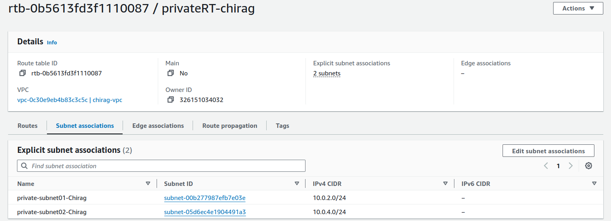

Assessment Project: End-to-End Deployment and Management of a Scalable E-Commerce Platform on AWS
======

**Objective:**

To evaluate your proficiency in designing, deploying, and managing a comprehensive and scalable e-commerce platform on AWS. The project will integrate multiple AWS services, including S3, EC2, Auto Scaling, Load Balancer, VPC (without NAT Gateway), and RDS. The platform must be highly available, secure, and optimized for performance.

**Project Scenario:**

You are tasked with deploying a scalable e-commerce platform for "ShopMax," an online retailer preparing for a major sales event. The platform needs to handle fluctuating web traffic, securely manage user and product data, and serve both dynamic and static content efficiently. The infrastructure should be cost-effective and secure, with high availability and fault tolerance.

## Project Steps and Deliverables:
### 1. VPC Design and Implementation :

- **Design a Custom VPC:**
    - Create a VPC with four subnets: two public subnets (for EC2 instances and Load Balancers) and two private subnets (for RDS and backend services).

<!-- vpc create -->

<!-- subnet create -->


<!-- route table create -->




- Set up an Internet Gateway to allow internet access for the public subnets.


- Configure routing tables to enable communication between the subnets, ensuring that the private subnets can only communicate with the public subnets.

- **Security Configuration:**
    - Create security groups to control inbound and outbound traffic for EC2 instances, Load Balancer, and RDS.
    - Implement network ACLs to add an additional layer of security at the subnet level.


### 2. S3 Bucket Configuration for Static Content :

- **Create and Configure S3 Buckets:**
    - Create an S3 bucket named shopmax-static-content-chirag for hosting static assets (e.g., images, CSS, JavaScript).

<!-- S3 bucket with css and js files -->


- Set appropriate bucket policies to allow public read access to the static content.

<!-- bucket policy -->


- Enable versioning and logging on the bucket for better management and auditability.


- **Optimize Content Delivery:**
    - (Optional) Set up an S3 bucket for backups or archival purposes, using lifecycle rules to transition older files to cheaper storage classes like Glacier.

### 3. EC2 Instance Setup and Web Server Configuration :

- **Launch EC2 Instances:**
    - Launch a pair of EC2 instances (t2.micro ONLY) in the public subnets using an Amazon Linux 2 AMI.

<!-- Webserver Ec2 Instance -->

<!-- Application Server Ec2 Instance -->


- SSH into the instances and install a web server (Apache or Nginx) along with necessary application dependencies.


- **Deploy the Application:**
    - Deploy the dynamic e-commerce application on both instances.

<!-- Installing Website and configuring it -->


- Configure the web server to serve dynamic content and integrate with the static content hosted on S3.

```bash
# first unzip the file
unzip -v PhotoFolio.zip makefile -d webapp/
cd webapp/

# now copy all the .html files from webapp to the /var/www/html/webapp/
sudo mkdir -p /var/www/html/webapp
sudo cp *html /var/www/html/webapp/
cd /var/www/html/webapp

# change the configuration file of apache2 by using below steps
cd /etc/apache2/sites-available
sudo cp 000-default.conf webapp.conf
```
> webapp.conf file
```xml
<VirtualHost *:80>
    ServerAdmin webmaster@localhost

    DocumentRoot /var/www/html/webapp

    ErrorLog ${APACHE_LOG_DIR}/webapp_error.log
    CustomLog ${APACHE_LOG_DIR}/webapp_access.log combined

    <Directory /var/www/html/webapp>
        Options Indexes FollowSymLinks
        AllowOverride All
        Require all granted
    </Directory>
</VirtualHost>
```
```bash
# after changing the config file of apache 2 use below commands
sudo a2dissite 000-default.conf
sudo a2ensite webapp.conf
sudo systemctl daemon-reload
sudo systemctl enable apache2
sudo systemctl restart apache2
```

<span style="color: red">
Change the paths of the css, js files and paths of all the images in all of the .html files with the path of objects in the s3 bucket <b>shopmax-static-content-chirag<b>
</span>

### 4. RDS Setup and Database Configuration :

- **Provision an RDS MySQL Instance:**
    - Launch an RDS instance (Free Tier Template Type, t3.micro ONLY) in the private subnets, ensuring that it is not publicly accessible.

    
    
    - Configure the database schema to support the e-commerce application (e.g., tables for users, orders, products).
    - Set up automated backups to ensure high availability.
    

- **Database Security:**

    - Implement security measures such as encryption at rest and in transit.
    - Restrict database access to only the EC2 instances in the public subnets via security groups.

    

### 5. Load Balancer and Auto Scaling Configuration :

- **Set Up an Application Load Balancer (ALB):**
    - Deploy an ALB in the public subnets to distribute traffic across the EC2 instances.
    - Create a target group and register the EC2 instances, ensuring health checks are configured properly.


- **Configure Auto Scaling:**

    - Before creating Auto Scaling group create launch template of Amazon Linux 2 AMI with t2 micro instance type


- Create an Auto Scaling group that launches additional EC2 instances based on traffic patterns (e.g., CPU utilization). (Desired: 2, minimum:1 and maximum: 2 instances)


- Define scaling policies to automatically add or remove instances based on demand.


- **Testing the Setup:**
    - Simulate traffic to test the scalability and fault tolerance of the infrastructure.
    - Verify that the ALB is evenly distributing traffic and that the Auto Scaling group is working as expected.


### 6. Testing, Validation, and Optimization :

- **Full Application Test:**
    - Access the e-commerce application via the ALB DNS name and ensure that both static and dynamic content is being served correctly.

<!-- for /app1/ -->

<!-- for /app2/ -->


- Validate database connections and transactions (e.g., creating orders, adding products).
- Test the security configurations by attempting to access restricted resources and ensuring proper logging of unauthorized access attempts.

- **Optimization:**
    - Review the architecture and suggest any potential optimizations, such as improving response time, reducing costs, or enhancing security.

- **Cleanup:**
    - Terminate all the resources created i.e VPC, EC2 instances, Templates, target group, security group, private key-pair, RDS instances, Auto scaling group, Application Load Balancer

1. EC2 instances:<br>


1. Auto Scaling group:<br>


1. Application Load Balancer:<br>


1. Target Groups:<br>


1. Private Key pair:<br>


1. Instance Templates:<br>


1. RDS Database:<br>


1. S3 bucket:<br>


1. VPC, Route Tables, Subnets, Internet Gateway and Security Groups:<br>


### 7. Documentation and Report :

- **Detailed Documentation:**
    - Document each step taken during the project, including VPC design, EC2 and RDS configurations, S3 setup, Load Balancer and Auto Scaling implementation, and security measures.
    - Provide screenshots and logs as evidence of configuration and testing.
    
<center style="cursor: pointer">
<a src=./README.md>README.md</a>
</center>

- **Final Report:**
    - Summarize the project, highlighting any challenges faced and how they were resolved.
    - Provide recommendations for future improvements or scaling strategies.
