Project : 19 August
Project: Deploying a Multi-Tier Architecture Application using CloudFormation
=======

**Project Objective:**

This project will test your ability to deploy a multi-tier architecture application using AWS CloudFormation. The deployment should include an EC2 instance, an S3 bucket, a MySQL DB instance in RDS, and a VPC, all within the specified constraints.

**Project Overview:**

You are required to design and deploy a multi-tier application using AWS CloudFormation. The architecture will include the following components:

1. **EC2 Instance:** Serve as the web server.
1. **S3 Bucket:** Store static assets or configuration files.
1. **RDS MySQL DB Instance:** Serve as the database backend.
1. **VPC:** Ensure secure communication between the components.

**Specifications:**

- **EC2 Instance:** Use a t2.micro instance type, located in the public subnet, with SSH access allowed from a specific IP range.

- **RDS MySQL DB Instance:** Use a t3.micro instance type, located in a private subnet.

- **S3 Bucket:** Use for storing configuration files or assets for the web server.

- **VPC:** Create a VPC with public and private subnets. No NAT Gateway or Elastic IP should be used. Internet access for the EC2 instance should be provided via an Internet Gateway attached to the VPC.

- **CloudFormation Template:** Participants must create a CloudFormation template to automate the deployment process.

- **Allowed Regions:** Deployment is restricted to the regions us-east-1, us-east-2, us-west-1, and us-west-2.

## Key Tasks:
### 1. Create a CloudFormation Template:

#### 1.1. VPC and Subnets:
- Define a VPC with one public and one private subnet.
- Attach an Internet Gateway to the VPC for public subnet access.

<!-- VPC resource map -->
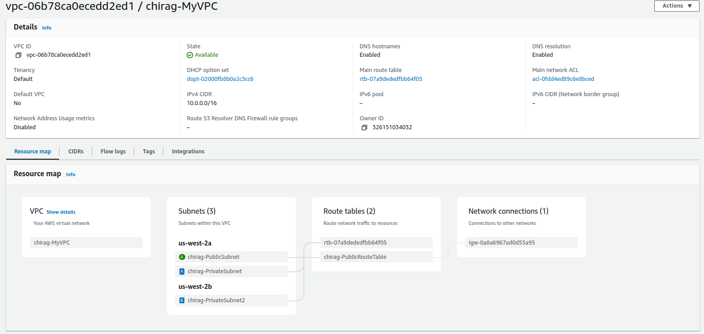
<!-- Routes of Public Route Table -->
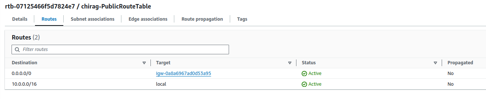

#### 1.2. Security Groups:
- Create a security group for the EC2 instance, allowing SSH and HTTP access from a specific IP range.
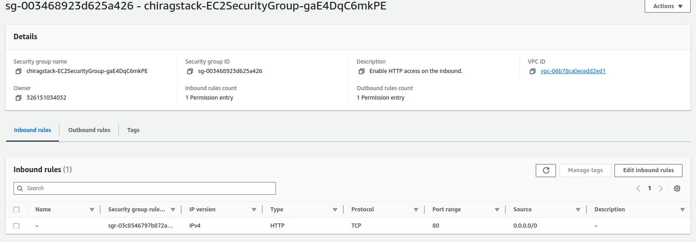
- Create a security group for the RDS instance, allowing MySQL access from the EC2 instance only.
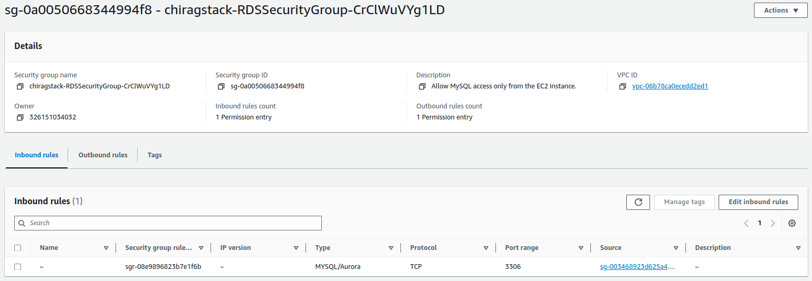

#### 1.3. EC2 Instance:
- Launch a t2.micro EC2 instance in the public subnet.
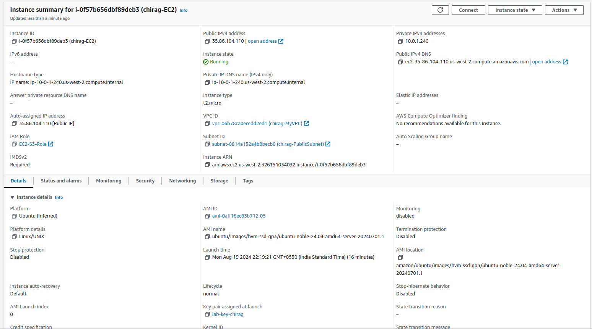
- Configure the instance to access the S3 bucket and connect to the RDS instance.

#### 1.4. S3 Bucket:
- Create an S3 bucket for storing static assets or configuration files.
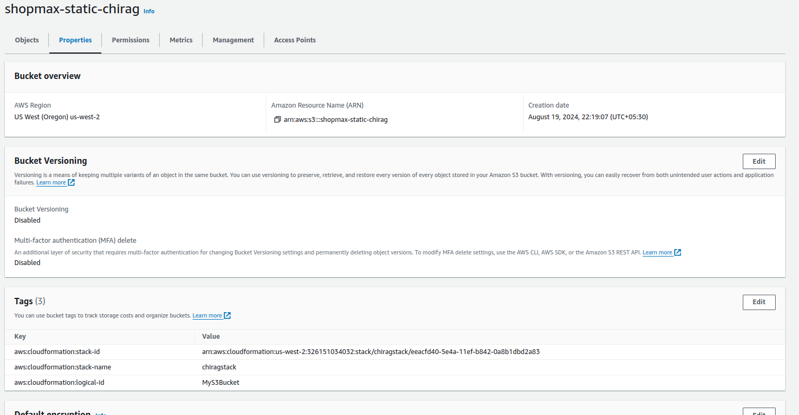
- Ensure the EC2 instance has the necessary IAM role and permissions to access the S3 bucket.
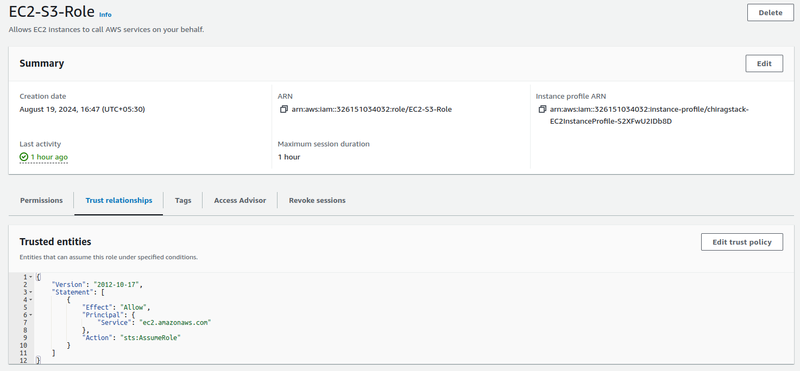

#### 1.5. RDS MySQL DB Instance:
- Launch a t3.micro MySQL database in the private subnet.
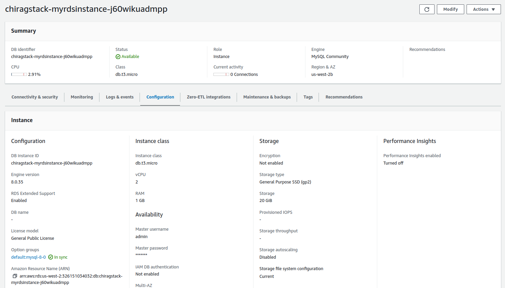
- Configure the security group to allow access only from the EC2 instance.

### 2. Deploy the Application:
- Deploy the CloudFormation stack using the template created.
- Verify that all components are correctly configured and operational.
- Ensure the EC2 instance can communicate with the RDS instance and access the S3 bucket.

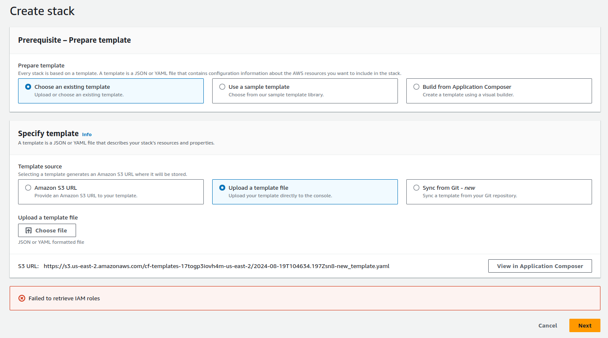

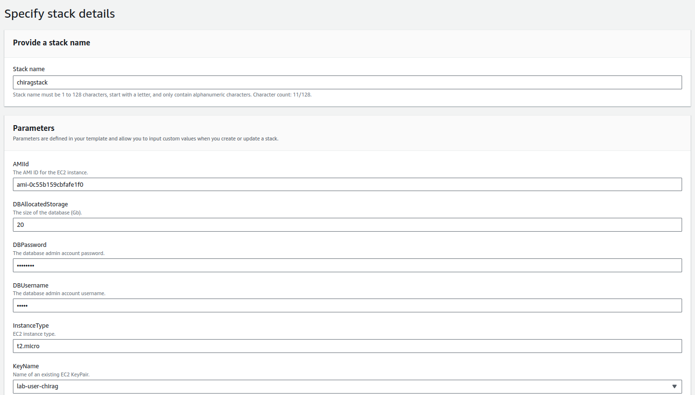

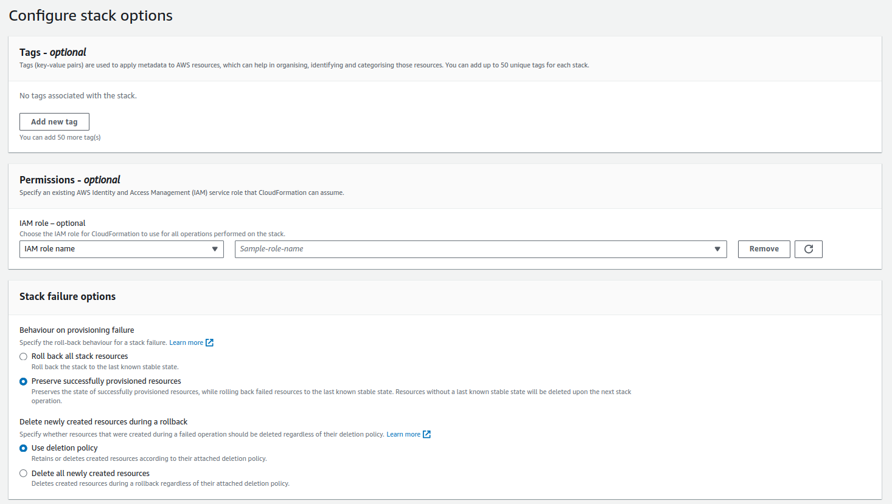

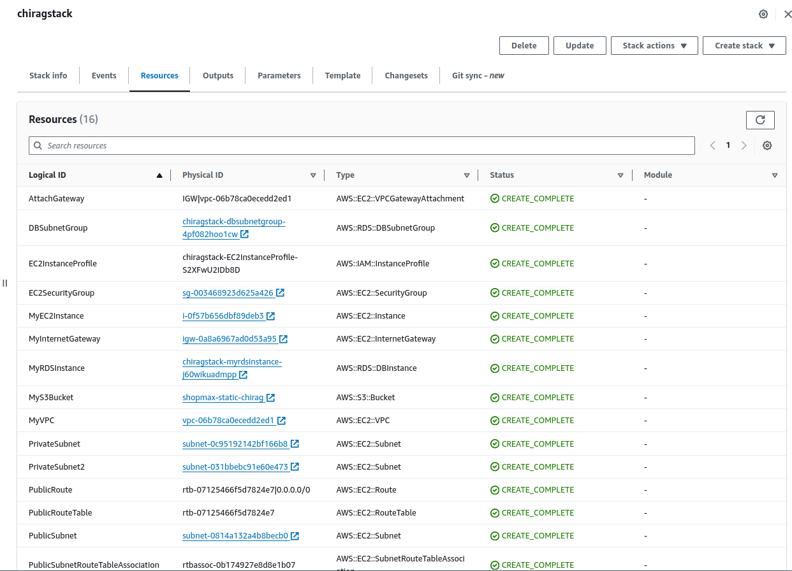

### 3. Testing:
- Test the deployed application by accessing it via the EC2 instance's public IP or DNS.
- Verify the connectivity between the EC2 instance and the RDS instance.
- Confirm that the EC2 instance can read from and write to the S3 bucket.
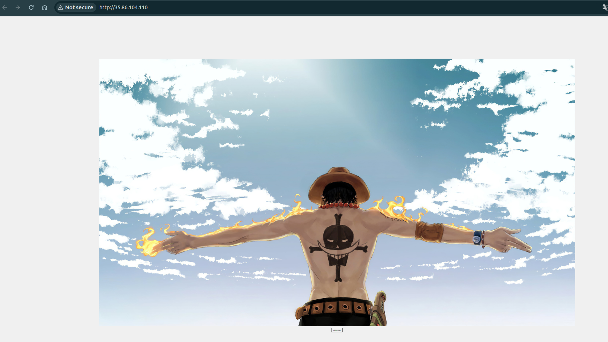

### 4. Documentation:
- Document the entire process, including the design decisions, the CloudFormation template, and the testing steps.
- Include screenshots or logs demonstrating the successful deployment and testing of the application.

<a href=README.md>README.md</a>

### 5. Resource Termination:
- Once the deployment and testing are complete, terminate all resources by deleting the CloudFormation stack.
- Ensure that no resources, such as EC2 instances, RDS instances, or S3 buckets, are left running.

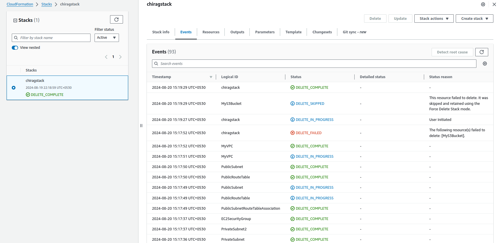

## Deliverables:

- **CloudFormation Template:** A complete template file (.yaml or .json) used for deployment.

- **Deployment Documentation:** Detailed documentation covering the deployment steps, design decisions, and testing process.

- **Test Results:** Evidence of successful deployment and testing, including screenshots or logs.

- **Cleanup Confirmation:** Confirmation that all resources have been terminated and no charges will continue to accrue.

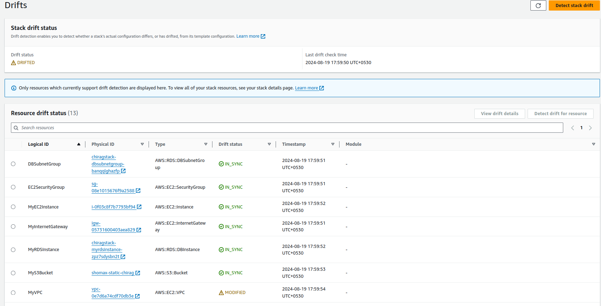
