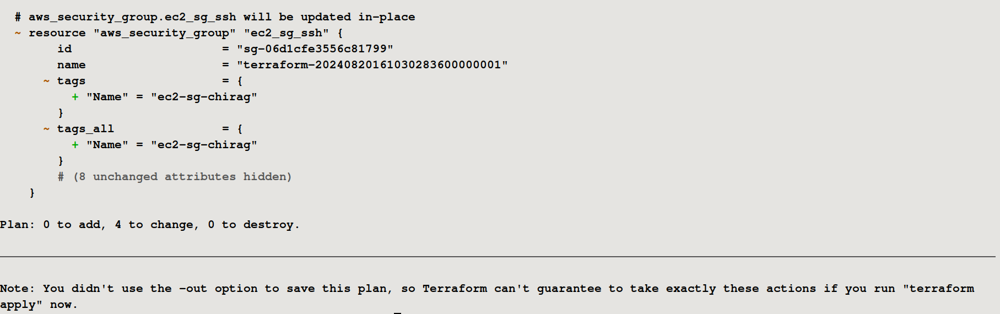
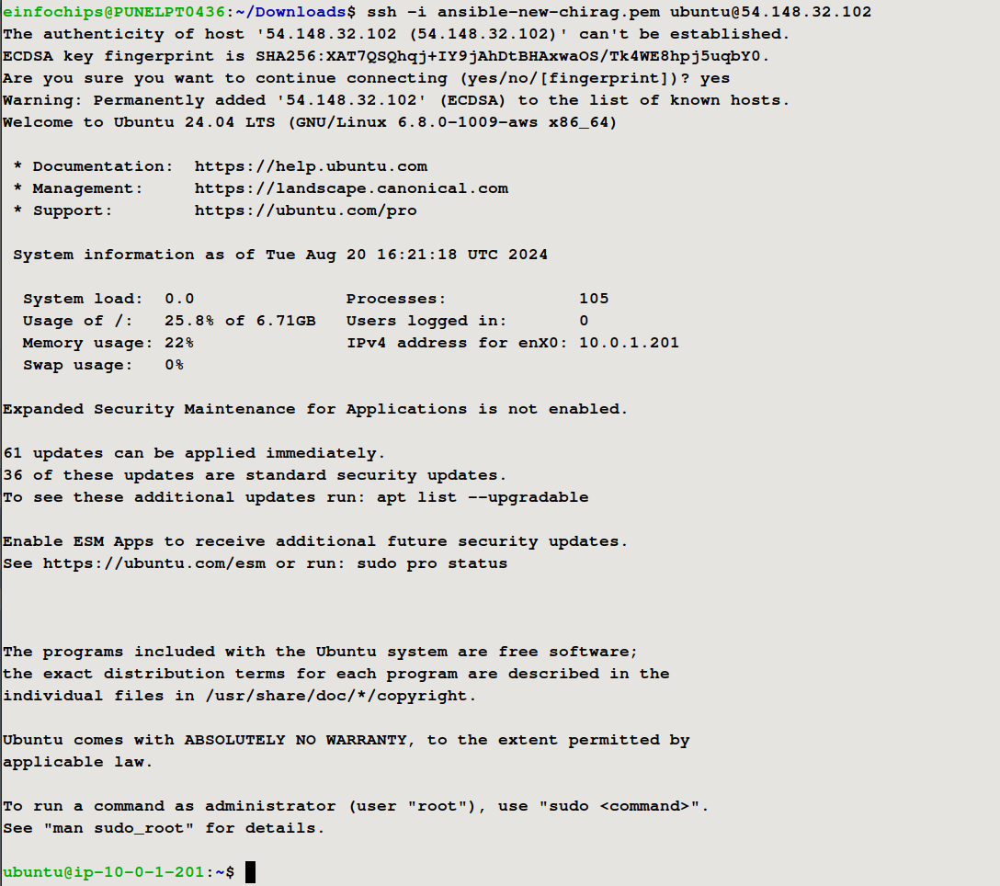

# Project: Deploying a Multi-Tier Architecture Application on AWS using Terraform

## Project Objective
This project aims to assess your ability to deploy a multi-tier architecture application on AWS using Terraform. The deployment will involve utilizing Terraform variables, outputs, and change sets. The architecture includes:

- **EC2 Instance**: A t2.micro instance serving as the application server.
- **RDS MySQL DB Instance**: A t3.micro instance for the database backend.
- **S3 Bucket**: For storing static assets or configuration files.

## Project Overview
You are required to write Terraform configuration files to automate the deployment of a multi-tier application on AWS. The architecture should consist of the following components:

- **EC2 Instance:**
    - Use the t2.micro instance type with a public IP.
    - Allow HTTP and SSH access.

- **RDS MySQL DB Instance:**
    - Use the t3.micro instance type.
    - Ensure the instance is publicly accessible with a public endpoint.

- **S3 Bucket:**
    - Use the bucket for storing static assets, configuration files, or backups.

## 1. Specifications

### 1.1. EC2 Instance
- **Instance Type**: t2.micro
- **Access**: Public IP, HTTP, and SSH access.

### 1.2. RDS MySQL DB Instance
- **Instance Type**: t3.micro
- **Access**: Publicly accessible endpoint.

### 1.3. S3 Bucket
- **Usage**: Store static assets, configuration files, or backups.

## 2. Terraform Configuration

### 2.1. Variables
- Utilize Terraform variables to parameterize the deployment (e.g., instance type, database name).<br>
[variables.tf](variables.tf)
### 2.2. Outputs
- Use Terraform outputs to display important information (e.g., EC2 public IP, RDS endpoint).<br>
[output.tf](output.tf)
### 2.3. Change Sets
- Implement change sets to demonstrate how Terraform manages infrastructure changes.

### 2.4. No Terraform Modules
- Focus solely on the core Terraform configurations without custom or external modules.

## 3. Key Tasks

### 3.1. Setup Terraform Configuration

#### 3.1.1. Provider Configuration
- Configure the AWS provider to specify the region for deployment.
- Parameterize the region using a Terraform variable.
```yml
# Configure AWS provider
provider "aws" {
  region = var.aws_region
}
variable "aws_region" {
  description = "The AWS region to deploy resources in"
  default     = "us-west-2"
}
```

#### 3.1.2. VPC and Security Groups
- Create a VPC with a public subnet for the EC2 instance.
```yml
# Create VPC, subnets, and security groups
resource "aws_vpc" "ProjectVPC" {
  cidr_block = "10.0.0.0/16"
  tags = {
    Name = "MyVPC-chirag"
  }
}
# Create a public subnet
resource "aws_subnet" "Project_public_subnet" {
  vpc_id                  = aws_vpc.ProjectVPC.id
  cidr_block              = "10.0.1.0/24"
  map_public_ip_on_launch = true
}
# Create a private subnet
resource "aws_subnet" "Project_private_subnet1" {
  vpc_id     = aws_vpc.ProjectVPC.id
  cidr_block = "10.0.2.0/24"
  availability_zone = "us-west-2a"
}

# Create a private subnet with availability zone
resource "aws_subnet" "Project_private_subnet2" {
    vpc_id     = aws_vpc.ProjectVPC.id
    cidr_block = "10.0.3.0/24"
    availability_zone = "us-west-2b"
}
# Create an internet gateway
resource "aws_internet_gateway" "Project_igw" {
  vpc_id = aws_vpc.ProjectVPC.id
  tags = {
    Name = "MyIGW-chirag"
  }
}
# Create a route table for the public subnet
resource "aws_route_table" "Project_public_rt" {
  vpc_id = aws_vpc.ProjectVPC.id

  route {
    cidr_block = "0.0.0.0/0"
    gateway_id = aws_internet_gateway.Project_igw.id
  }
}
# Associate the route table with the public subnet
resource "aws_route_table_association" "Project_public_rt_assoc" {
  subnet_id      = aws_subnet.Project_public_subnet.id
  route_table_id = aws_route_table.Project_public_rt.id
}
```
- Define security groups allowing:
  - HTTP and SSH access to the EC2 instance.
```yml
# Create EC2 Security Group
resource "aws_security_group" "ec2_sg_ssh" {
  vpc_id = aws_vpc.ProjectVPC.id
  tags = {
    Name = "ec2-sg-chirag"
  }
  ingress {
    from_port   = 22
    to_port     = 22
    protocol    = "tcp"
    cidr_blocks = ["0.0.0.0/0"]
  }
  ingress {
    from_port   = 80
    to_port     = 80
    protocol    = "tcp"
    cidr_blocks = ["0.0.0.0/0"]
  }

  egress {
    from_port   = 0
    to_port     = 0
    protocol    = "-1"
    cidr_blocks = ["0.0.0.0/0"]
  }
}
```
  - MySQL access to the RDS instance.
```yml
# Create RDS Security Group
resource "aws_security_group" "ec2_rds_ssh" {
  vpc_id = aws_vpc.ProjectVPC.id
  tags = {
    Name = "rds-sg-chirag"
  }
  ingress {
    from_port       = 3306
    to_port         = 3306
    protocol        = "tcp"
    security_groups = [aws_security_group.ec2_sg_ssh.id]
  }

  ingress {
    from_port   = 22
    to_port     = 22
    protocol    = "tcp"
    cidr_blocks = ["0.0.0.0/0"]
  }
}

# create subnet group
resource "aws_db_subnet_group" "rds_subnet_group" {
    name       = "rds_subnet_group"
    subnet_ids = [aws_subnet.Project_private_subnet1.id, aws_subnet.Project_private_subnet2.id]
    tags = {
        Name = "RDS Subnet Group"
    }
}
```
### 3.2. EC2 Instance
- Define the EC2 instance using a t2.micro instance type.
- Configure the instance to allow SSH and HTTP access.
```yml
# Create EC2 instance
resource "aws_instance" "webserver" {
  ami           = var.ec2_ami_id # Ubuntu 22.04 lts
  instance_type = var.ec2_instance_type
  iam_instance_profile        = aws_iam_instance_profile.ec2_instance_profile.name
  associate_public_ip_address = true
  subnet_id                   = aws_subnet.Project_public_subnet.id
  vpc_security_group_ids      = [aws_security_group.ec2_sg_ssh.id]
  key_name                    = "your_private_key"
  tags = {
    Name = "WebServer-chirag"
    Project = "Shopmax-Static"
  }
  user_data = <<-EOF
    #!/bin/bash
    apt update -y
    sudo apt install -y nginx
    sudo systemctl start nginx
    sudo systemctl enable nginx
  EOF
}
```
- Use Terraform variables to define instance parameters like AMI ID and instance type.
```yml
# EC2 Instance AMI Id
variable "ec2_ami_id" {
  default = "ami-0aff18ec83b712f05"

}

# EC2 Instance Type
variable "ec2_instance_type" {
  default = "t2.micro"
}

```

### 3.3. RDS MySQL DB Instance
- Create a t3.micro MySQL DB instance within the same VPC.
```yml
# Create RDS MySQL instance
resource "aws_db_instance" "appdb" {
  engine                 = "mysql"
  engine_version         = "5.7"
  instance_class         = var.db_instance_type
  db_name                = var.db_name
  username               = var.db_username
  password               = var.db_password
  allocated_storage      = 20
  publicly_accessible    = false
  db_subnet_group_name   = aws_db_subnet_group.rds_subnet_group.name
  vpc_security_group_ids = [aws_security_group.ec2_rds_ssh.id]
  skip_final_snapshot = false
  tags = {
    Name = "RDS-Instance-chirag"
  }
}
```
- Use Terraform variables to define DB parameters like DB name, username, and password.
```yml
variable "db_instance_type" {
  default = "db.t3.micro"
}
variable "db_name" {
  default = "your_dbname"
}
variable "db_username" {
  default = "your_username"
}
variable "db_password" {
  default = "your_password"
}
```
- Ensure the DB instance is publicly accessible.and Configure security groups to allow access from the EC2 instance.
```yml
# Create RDS Security Group
resource "aws_security_group" "ec2_rds_ssh" {
  vpc_id = aws_vpc.ProjectVPC.id

  ingress {
    from_port       = 3306
    to_port         = 3306
    protocol        = "tcp"
    security_groups = [aws_security_group.ec2_sg_ssh.id]
  }
  ingress {
    from_port       = 3306
    to_port         = 3306
    protocol        = "tcp"
    cidr_blocks = ["0.0.0.0/0"]
  }

  ingress {
    from_port   = 22
    to_port     = 22
    protocol    = "tcp"
    cidr_blocks = ["0.0.0.0/0"]
  }
}
```


### 3.4. S3 Bucket
- Create an S3 bucket for storing static files or configurations.
```yml
# Create S3 bucket
resource "aws_s3_bucket" "app_bucket" {
  bucket = var.bucket_name
  tags = {
    Name = "shopmax-static-chirag"
  }
}
```
- Allow the EC2 instance to access the S3 bucket by assigning the appropriate IAM role and policy.
```yml
# associate iam role with ec2 instance
resource "aws_iam_instance_profile" "ec2_instance_profile" {
  name = "ec2_instance_profile"
  role = basename(var.ec2_iam_role_arn)
}

resource "aws_s3_bucket_policy" "s3_policy" {
  bucket = aws_s3_bucket.app_bucket.id

  policy = jsonencode({
    Version = "2012-10-17"
    Statement = [
      {
        Effect = "Allow"
        Principal = {
          AWS = var.ec2_iam_role_arn
        }
        Action = [
          "s3:GetObject",
          "s3:PutObject",
          "s3:ListBucket"
        ]
        Resource = [
          aws_s3_bucket.app_bucket.arn,
          "${aws_s3_bucket.app_bucket.arn}/*"
        ]
      }
    ]
  })
}
```

### 3.5. Outputs
- Define Terraform outputs to display:
  - EC2 instance’s public IP address.
  - RDS instance’s endpoint.
  - S3 bucket name.
```yml
# Output important information
output "ec2_public_ip" {
  value = aws_instance.webserver.public_ip
}

output "rds_endpoint" {
  value = aws_db_instance.appdb.endpoint
}
output "s3_bucket_name" {
  value = aws_s3_bucket.app_bucket.bucket
}
```

## 4. Apply and Manage Infrastructure

### 4.1. Initial Deployment
1. Run `terraform init` to initialize the configuration.<br>


2. Use `terraform plan` to review the infrastructure changes before applying.<br>


3. Deploy the infrastructure using `terraform apply` and ensure that the application server, database, and S3 bucket are set up correctly.


### 4.2. Change Sets
1. Make a minor change in the Terraform configuration (e.g., modify an EC2 instance tag or change an S3 bucket policy).
2. Use `terraform plan` to generate a change set, showing what will be modified.


3. Apply the change set using `terraform apply` and observe how Terraform updates the infrastructure without disrupting existing resources.


### 4.3. Testing and Validation
- Validate the setup by:
  - Accessing the EC2 instance via SSH and HTTP.

  
  
  
  
  - Connecting to the MySQL DB instance from the EC2 instance.

  


  - Verifying that the EC2 instance can read and write to the S3 bucket.

  
  

- Check the Terraform outputs to ensure they correctly display the relevant information.


### 4.4. Resource Termination
- Once the deployment is complete and validated, run `terraform destroy` to tear down all the resources created by Terraform.

- Confirm that all AWS resources (EC2 instance, RDS DB, S3 bucket, VPC) are properly deleted.


## 5. Documentation

### 5.1. Include
- The entire process, including Terraform configurations.
- The purpose of each Terraform file, variables used, and outputs.
- Screenshots or logs demonstrating the deployment, testing, and destruction of the resources.

## 6. Deliverables

1. **Terraform Configuration Files**: All `.tf` files used in the deployment.
    - [main.tf](main.tf)
    - [variables.tf](variables.tf)
    - [output.tf](output.tf)
2. **Deployment Documentation**: Detailed documentation covering the setup, deployment, change management, and teardown processes.
    - [Readme.md](README.md)
3. **Test Results**: Evidence of successful deployment and testing, including screenshots or command outputs.
    - [images](img/)
4. **Cleanup Confirmation**: Confirmation that all resources have been terminated using `terraform destroy`.
    - [Destoryed log file](terraform_destroy.log)
