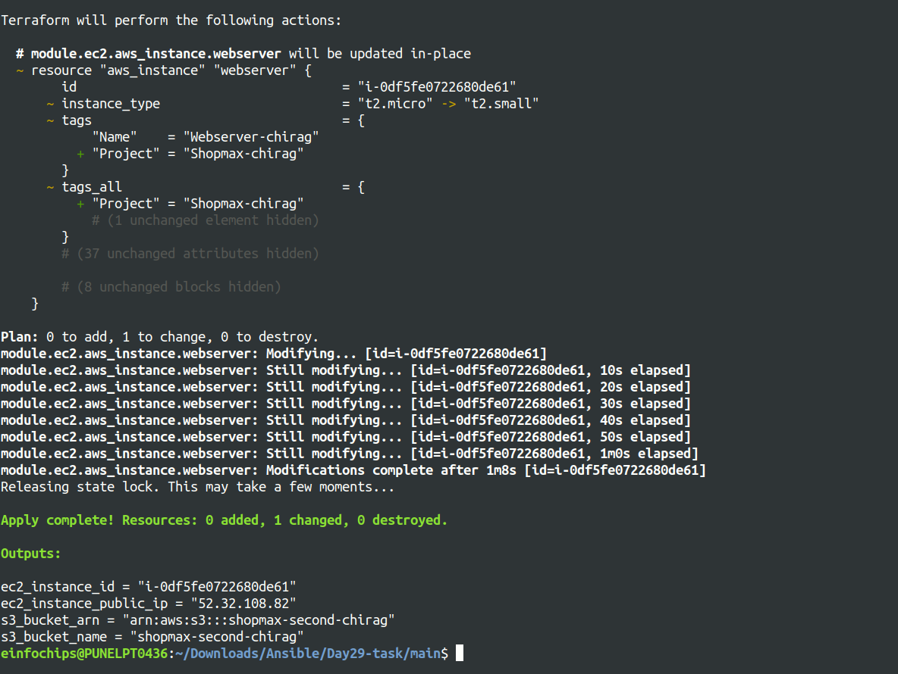

# Advanced Terraform with Modules, Functions, State Locks, Remote State Management, and Variable Configuration

## Project Objective

This project aims to test your skills in using Terraform modules, functions, variables, state locks, and remote state management. You will deploy infrastructure on AWS using a custom Terraform module, manage the state remotely in an S3 bucket, and test the locking mechanism with DynamoDB. Additionally, you will configure variables and outputs using Terraform functions to parameterize configurations.

## Project Overview

You will create a Terraform configuration that utilizes a custom module to deploy a multi-component infrastructure on AWS. The state files will be stored remotely in an S3 bucket, and DynamoDB will handle state locking to prevent concurrent changes. The project will involve:

- Creating a flexible and reusable Terraform module
- Using input variables (`tfvars`) and Terraform functions to parameterize configurations
- Managing Terraform state remotely and securely

## Specifications

### 1. Terraform Modules
- Create a reusable module that can deploy both an EC2 instance and an S3 bucket.

### 2. Terraform Functions
- Use Terraform built-in functions to manipulate and compute variable values, such as `length`, `join`, and `lookup`.

### 3. State Management
- Store the Terraform state in an S3 bucket and configure DynamoDB for state locking to prevent concurrent changes.

### 4. Variable Configuration (`tfvars`)
- Parameterize the infrastructure using variables for instance type, region, and other configurable options.

### 5. Outputs
- Use outputs to display important information such as EC2 instance details and the S3 bucket name after deployment.

## Key Tasks

### Remote State Management

#### S3 Bucket for State
- Create an S3 bucket using Terraform (this can be separate from the custom module).

```yml
provider "aws" {
  region = "us-west-2"  # Update this to your preferred AWS region
}

# S3 bucket for Terraform state
resource "aws_s3_bucket" "terraform_state" {
  bucket = "shopmax-static-chirag"  # Replace with a unique bucket name

  tags = {
    Name = "S3-bucket-chirag"
  }
}

# Enable versioning for the S3 bucket
resource "aws_s3_bucket_versioning" "s3_versioning" {
  bucket = aws_s3_bucket.terraform_state.id
  versioning_configuration {
    status = "Enabled"
  }
}

output "s3_bucket_name" {
  value = aws_s3_bucket.terraform_state.bucket
}
```

#### State Locking with DynamoDB
- Create a DynamoDB table using Terraform (or manually if required) to store state lock information.
```yml
# DynamoDB table for state locking
resource "aws_dynamodb_table" "terraform_lock" {
  name         = "terraform-lock-table-chirag"
  read_capacity  = 5
  write_capacity = 5
  hash_key      = "LockID"
  billing_mode  = "PROVISIONED"

  attribute {
    name = "LockID"
    type = "S"
  }

  tags = {
    Name = "DynamoDb-chirag"
  }
}

output "dynamodb_table_name" {
  value = aws_dynamodb_table.terraform_lock.name
}
```
- Configure Terraform to store the state file in the S3 bucket and to use this DynamoDB table for state locking.

```yml
terraform {
  backend "s3" {
    bucket         = "shopmax-static-chirag"  # Same as the S3 bucket name
    key            = "terraform.tfstate"  # Replace with the path where you want to store the state file
    region         = "us-west-2"  # Same as the S3 bucket region
    dynamodb_table = "terraform-state-lock-chirag"  # Same as the DynamoDB table name
    encrypt        = true
  }
}
```


### Terraform Module Creation

#### Custom Module
- **EC2 Instance**: Deploy an EC2 instance using an AMI for the region and allow SSH access using a security group.
- **S3 Bucket**: Create an S3 bucket for application data.

#### Terraform Variables (`tfvars`)
- **Instance Type**: Allow the instance type to be configurable (e.g., `t2.micro`).
- **Region**: Parameterize the AWS region so that the module can be reused across regions.
- **Bucket Name**: Use a variable to set the S3 bucket name.

#### Terraform Functions
- Use `join` and `list` to list and combine strings for resource names.
```bash
variable "cidr_blocks" {
  type    = list(string)
  default = []
}

# Output the combined CIDR blocks as a single string
output "cidr_blocks_string" {
  value = join(", ", var.cidr_blocks)
}
```
- Use `lookup` to set default values if a variable is not provided.
```bash
resource "aws_instance" "webserver" {
  ami                         = lookup(var.ami, "ami-05134c8ef96964280")
  instance_type               = lookup(var.instance_type, "t3.micro") 
  iam_instance_profile        = var.iam_ec2_profile_name
  associate_public_ip_address = true
  subnet_id                   = var.public_subnet_id
  vpc_security_group_ids      = [var.security_group_id]
  key_name                    = var.key_pair
  tags = {
    Name = lookup(var.instance_name, "Webserver-Chirag")
    Project = var.project_name
  }
}
```
- Use `length` to count the number of instances or resources.
```bash
# Define a variable for multiple security group IDs
variable "security_group_ids" {
  type    = list(string)
  default = []
}

# Example using length to count the number of instances
output "instance_count" {
  value = length([aws_instance.webserver.id])
}
```

### Input Variables and Configuration (`tfvars`)
- Define input variables to make the infrastructure flexible:
  - EC2 instance type.
  - S3 bucket name.
  - AWS region.
  - Any other variable relevant to the infrastructure.
- Use the `default` argument for variables where appropriate.

### Output Configuration
- Set up Terraform outputs to display key information after the infrastructure is created:
  - **EC2 Public IP**: Output the public IP of the EC2 instance.
  - **S3 Bucket Name**: Output the name of the S3 bucket created.
  - **Region**: Output the region where the resources were deployed.

### Testing State Locking and Remote State

#### State Locking
- Attempt to run `terraform apply` from two different terminals simultaneously to test state locking.
- Confirm that DynamoDB properly handles the state lock, preventing concurrent updates.

<!--  -->

#### Remote State Management
- Verify that Terraform state is being stored in the S3 bucket and that updates are reflected in the remote state file.


### Apply and Modify Infrastructure

#### Initial Deployment
- Use `terraform plan` and `terraform apply` to deploy the infrastructure.


- Verify that the EC2 instance, S3 bucket, and all configurations are properly set up.
<!--  -->
<!--  -->

#### Infrastructure Changes
- Modify one of the variables (e.g., change the instance type or add tags) and re-run `terraform apply`.
added the new tag to the ec2 instance and changed the ec2 instance type to the t2.small




- Observe how Terraform plans and applies only the necessary changes, with state locking in effect.
<!--  -->

#### Resource Termination
- Once the deployment is complete and tested, use `terraform destroy` to tear down all the resources created by Terraform.
- Ensure that the S3 bucket, EC2 instance, and DynamoDB table (if not reused) are deleted.


## Documentation

- Document the Terraform module, including how to use the variables, functions, and state management.
- Include instructions on how to configure and manage the remote state and locking mechanism.
- Provide screenshots or logs showing the deployment process and testing of state locking.

## Deliverables

- **Terraform Configuration Files**: All `.tf` files including the main configuration and the custom module.
- **Documentation**: Detailed documentation explaining the use of variables, functions, state management, and how to test the locking mechanism.
- **Test Results**: Evidence that state locking was successfully tested (e.g., screenshots of simultaneous `terraform apply` attempts).
- **Resource Teardown Confirmation**: Confirmation that all AWS resources were properly destroyed using `terraform destroy`.
