# Advanced Terraform with Provisioners, Modules, and Workspaces

## Project Objective

This project aims to evaluate your understanding of Terraform provisioners, modules, and workspaces. You will deploy a basic infrastructure on AWS using Terraform modules, execute remote commands on provisioned resources using provisioners, and manage multiple environments using Terraform workspaces. All resources will be within the AWS Free Tier limits.

## Project Overview

You will create a Terraform configuration that deploys an EC2 instance and an S3 bucket using a custom Terraform module. The project requires using Terraform provisioners to execute scripts on the EC2 instance. Finally, you will manage separate environments (e.g., dev and prod) using Terraform workspaces.

## Specifications


configured aws profiles dev, staging and prod
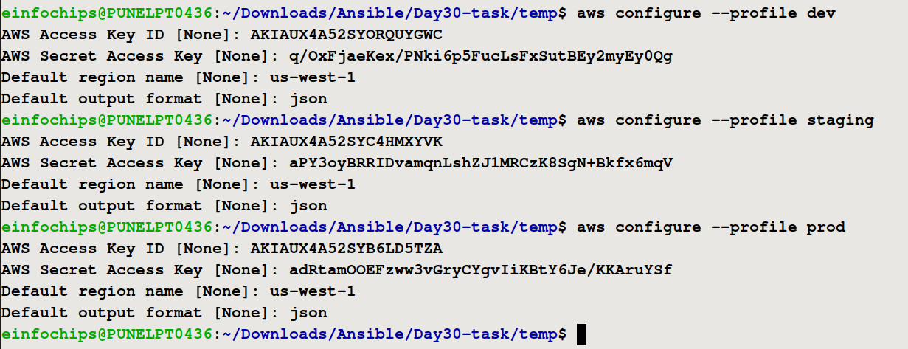

### Terraform Modules

- **Module Components:**
  - Create a reusable module to deploy an EC2 instance and an S3 bucket.
  - EC2 instance type: `t2.micro`.
  - S3 bucket: Standard storage configuration.
- **Input Variables:**
  - Instance type, AMI ID, key pair name, bucket name.
- **Outputs:**
  - EC2 instance’s public IP.
  - S3 bucket’s ARN.

### Terraform Provisioners

- **remote-exec:**
  - Connect to the EC2 instance via SSH.
  - Run a script to install Apache HTTP Server.
- **local-exec:**
  - Output a message on the local machine indicating deployment status (e.g., "EC2 instance successfully provisioned with Apache").

### Terraform Workspaces

- **Workspace Management:**
  - Implement Terraform workspaces for `dev` and `prod` environments.
  - Each workspace deploys the same infrastructure with different configurations (e.g., tags, bucket names).
- **State Management:**
  - Ensure state files for each workspace are managed separately.

## Key Tasks

### A. Module Development

1. **Module Setup:**
   - Create a directory for the module: `modules/ec2 and modules/s3`.
   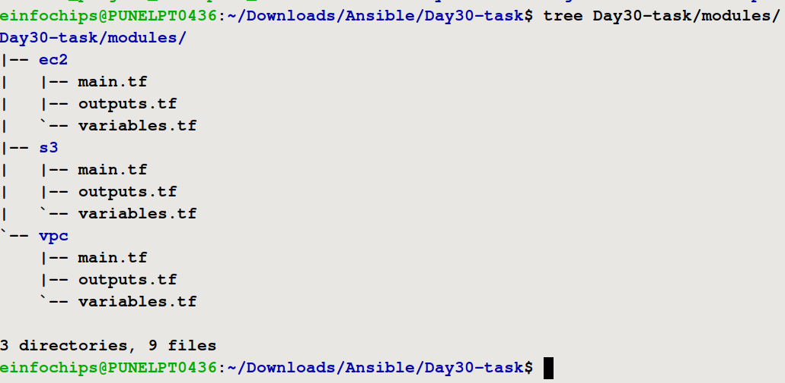

2. **Resource Definitions:**
   - Define resources for an EC2 instance and S3 bucket.
```bash
# Create EC2 instance
resource "aws_instance" "webserver" {
  ami                         = lookup(var.ami_map, "ami1", "ami-05134c8ef96964280")
  instance_type               = var.instance_type
  iam_instance_profile        = var.iam_ec2_profile_name
  associate_public_ip_address = true
  subnet_id                   = var.public_subnet_id
  vpc_security_group_ids      = [var.security_group_id]
  key_name                    = var.key_pair
  tags = {
    Name = var.instance_name
    Project = var.project_name
  }
}
```
```bash
resource "aws_s3_bucket" "this" {
  bucket = var.bucket_name
  tags = {
    Name = var.bucket_name
  }
}

# associate iam role with ec2 instance
resource "aws_iam_instance_profile" "ec2_instance_profile" {
  name = "ec2_instance_profile"
  role = basename(var.ec2_iam_role_arn)
}

resource "aws_s3_bucket_policy" "s3_policy" {
  bucket = aws_s3_bucket.this.id

  policy = jsonencode({
    Version = "2012-10-17"
    Statement = [
      {
        Effect = "Allow"
        Principal = {
          AWS = var.ec2_iam_role_arn
        }
        Action = [
          "s3:GetObject",
          "s3:PutObject",
          "s3:ListBucket"
        ]
        Resource = [
          aws_s3_bucket.this.arn,
          "${aws_s3_bucket.this.arn}/*"
        ]
      }
    ]
  })
}
```
3. **Variable Inputs:**
   - Define input variables for instance type, AMI ID, key pair name, and S3 bucket name.
```bash
variable "ami_map" {
  description = "AMI ID for the EC2 instance"
  type        = string
  default = "ami-05134c8ef96964280"  #ubuntu version 24.40
}

variable "instance_type" {
  description = "Instance type for the EC2 instance"
  type        = string
}

variable "instance_name" {
  description = "Name tag for the EC2 instance"
  type        = string
}

variable "key_pair" {
  description = "Name of your private key pair"
  type = string
}

variable "iam_ec2_profile_name" {
  description = "iam profile name for ec2"
  type = string
}

variable "public_subnet_id" {
  description = "public subnit id for ec2"
  type = string
}

variable "security_group_id" {
  description = "security group id for ec2"
  type = string
}

variable "project_name" {
  description = "Adding Project Tag to Ec2 instance"
  type = string
}
```

```bash
variable "bucket_name" {
  description = "The name of the S3 bucket"
  type        = string
}

# EC2 IAM Role ARN
variable "ec2_iam_role_arn" {
  description = "The ARN of the IAM role attached to the EC2 instance."
  type = string
}
```
4. **Outputs:**
   - Define outputs for the EC2 instance's public IP and the S3 bucket's ARN.
```bash
output "instance_id" {
  description = "The ID of the EC2 instance"
  value       = aws_instance.webserver.id
}

output "instance_public_ip" {
  description = "The public IP address of the EC2 instance"
  value       = aws_instance.webserver.public_ip
}

```
```bash
output "bucket_arn" {
  description = "The ARN of the S3 bucket"
  value       = aws_s3_bucket.this.arn
}

output "bucket_name" {
  description = "The name of the S3 bucket"
  value       = aws_s3_bucket.this.bucket
}

output "iam_ec2_profile_name" {
  description = "name of the ec2 instance profle name"
  value       = aws_iam_instance_profile.ec2_instance_profile.name
}
```

### B. Main Terraform Configuration

1. **Main Config Setup:**
   - Create a Terraform configuration in the root directory that calls the custom module.
2. **Backend Configuration (Optional):**
   - Configure Terraform to use local state storage for simplicity.

```bash
terraform {
  required_providers {
    aws = {
        source = "hashicorp/aws"
        version = "~> 5.0"
    }
  }
  backend "local" {}
}

provider "aws" {
  region = "us-west-2"
  profile = terraform.workspace
}

module "ec2" {
  source         = "./modules/ec2"
  ami_map        = var.ami
  instance_type  = var.instance_type
  instance_name  = var.instance_name
  key_pair       = var.key_pair
  public_subnet_id = module.vpc.ec2_instance_subnet_id
  security_group_id = module.vpc.vpc_ec2_sg_id
  iam_ec2_profile_name = module.s3.iam_ec2_profile_name
  # project_name = var.project_name
}

module "s3" {
  source       = "./modules/s3"
  bucket_name  = var.bucket_name
  ec2_iam_role_arn = var.ec2_iam_role_arn
}

module "vpc" {
  source = "./modules/vpc"
  vpc_cidr = var.vpc_cidr_ip
  pub_subnet_cidr = var.pub_subnet_cidr_ip
}
```

### C. Provisioner Implementation

1. **Remote Execution:**
   - Use the `remote-exec` provisioner to SSH into the EC2 instance and execute a script that installs Apache.
2. **Local Execution:**
   - Use the `local-exec` provisioner to print a confirmation message after successful deployment.

### D. Workspace Management

1. **Workspace Creation:**
   - Create Terraform workspaces for `dev` and `prod`.
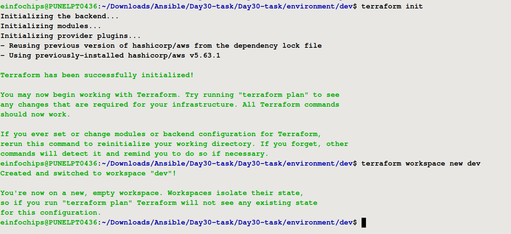
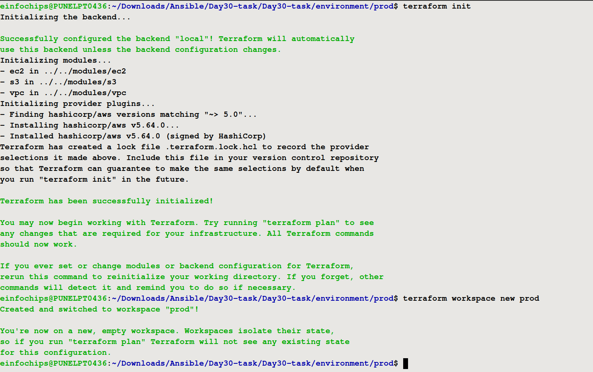
2. **Environment-Specific Configurations:**
   - Customize EC2 instance tags and S3 bucket names for each workspace.
```bash
tags = {
    Name = "${terraform.workspace}-${var.instance_name}"
  }
```
3. **Workspace Deployment:**
   - Deploy infrastructure in each workspace.
> dev
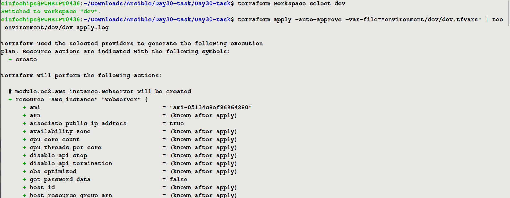
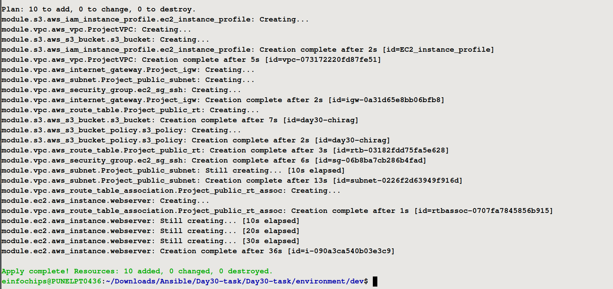
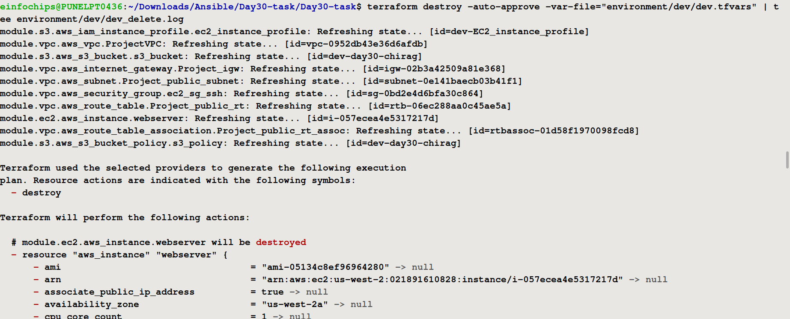

> prod
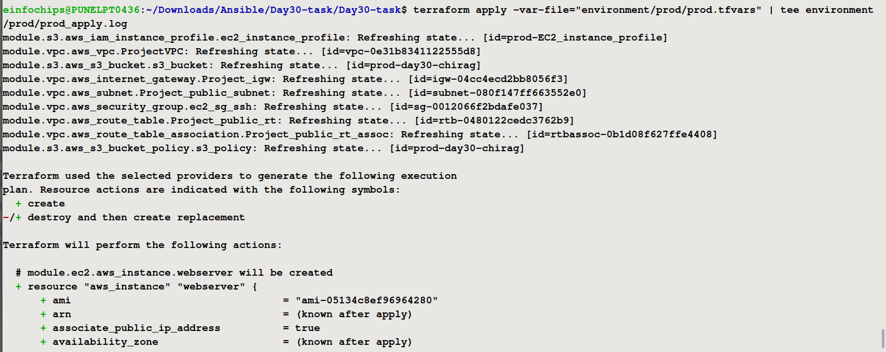
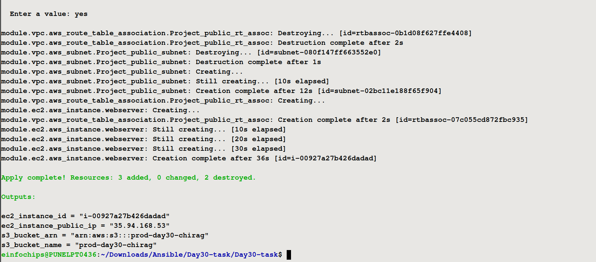
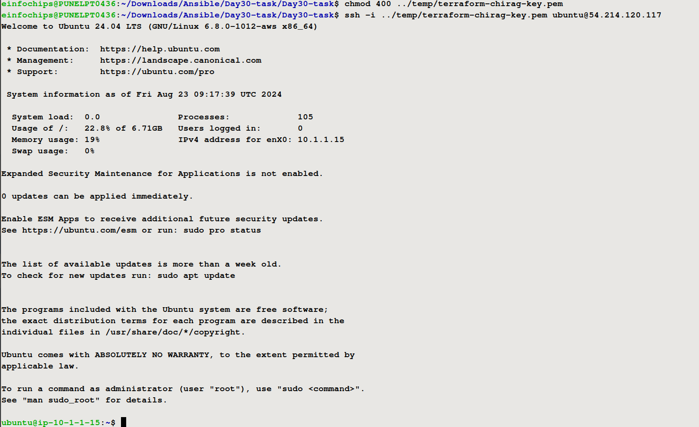

### E. Validation and Testing

1. **Apache Installation Verification:**
   - Verify Apache is running on the EC2 instance by accessing its public IP in a web browser.
2. **Workspace Separation:**
   - Confirm isolated infrastructure and state files for each workspace.
3. **Provisioner Logs:**
   - Review logs from the `local-exec` provisioner for successful deployment messages.

### F. Resource Cleanup

1. **Destroy Resources:**
   - Use `terraform destroy` to remove resources in both workspaces.
> dev
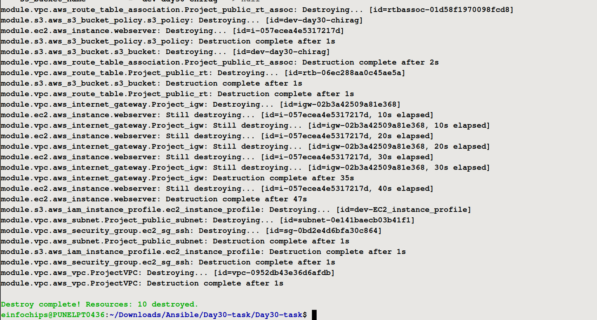
> prod
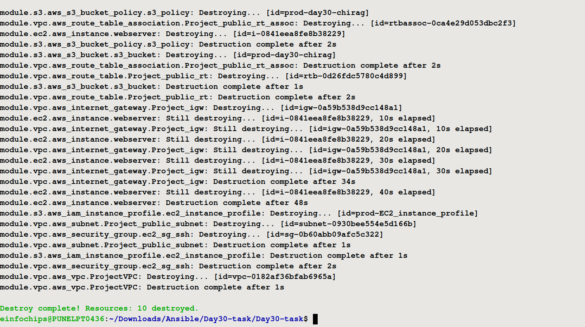
2. **Workspace Management:**
   - Confirm resources are destroyed separately and state files updated.

## Documentation

1. **Module Documentation:**
   - Provide detailed documentation of the Terraform module, including variables, provisioners, and outputs.
2. **Workspace Documentation:**
   - Document the process for creating and managing Terraform workspaces.
3. **Provisioner Documentation:**
   - Include descriptions of the provisioners used and their purpose.<br>
  [README.md](README.md)
## Deliverables

1. **Terraform Module:**
   - Reusable module files in `modules/aws_infrastructure`.
2. **Main Terraform Configuration:**
   - Root Terraform configuration files.
3. **Provisioner Scripts:**
   - Scripts used by `remote-exec` provisioner.
4. **Workspace Documentation:**
   - Documentation on using Terraform workspaces.
5. **Validation Screenshots/Logs:**
   - Screenshots or logs showing successful provisioner execution and Apache running on the EC2 instance.
6. **Cleanup Confirmation:**
   - Evidence of successful resource destruction in all workspaces.
