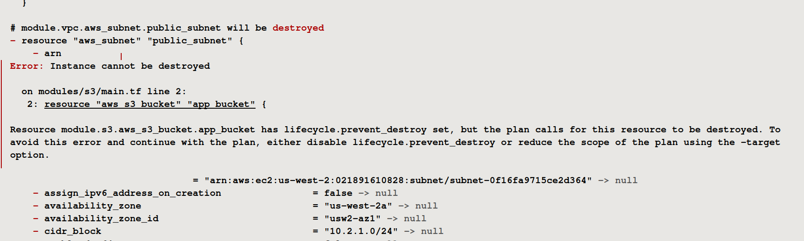

# Automation (IaaC) Terraform on AWS Assessment Project

## Project Overview

This project is designed to assess practical skills and knowledge of Terraform with a focus on AWS. It involves deploying a complete infrastructure using Terraform, adhering to AWS Free Tier resources to avoid unnecessary costs.

## Project Objectives

- Deploy a multi-tier architecture on AWS using Terraform.
- Implement state locking to manage concurrent changes.
- Use variables and `.tfvars` files to parameterize configurations.
- Create and use Terraform modules to promote reusability and organization.
- Utilize functions to dynamically configure resources.
- Manage multiple environments using Terraform workspaces.
- Implement lifecycle rules to control resource creation, updates, and deletion.

## Project Requirements

### 1. Infrastructure Design

The infrastructure will deploy a basic 3-tier web application architecture, including:

- **VPC**: A Virtual Private Cloud (VPC) with public and private subnets across two availability zones.
- **Security Groups**: Control inbound and outbound traffic for the application and database tiers.
- **EC2 Instances**: Deploy EC2 instances in public subnets for the web servers (Application Tier).
- **RDS Instance**: Deploy an RDS MySQL instance in the private subnet for the database (Database Tier).
- **S3 Bucket**: Create an S3 bucket for storing static files, with versioning enabled.
- **Elastic IPs**: Assign Elastic IPs to the EC2 instances.
- **IAM Role**: Create an IAM role with necessary permissions and attach it to the EC2 instances.

### 2. Terraform State Management

- Implement remote state storage using an S3 bucket for the Terraform state file.
- Use DynamoDB for state locking to prevent concurrent modifications.
<!--  -->

### 3. Variables and `.tfvars`

- Define input variables for resources like VPC CIDR, instance types, database credentials, and S3 bucket names.
- Use `.tfvars` files to pass different configurations for environments (e.g., `dev.tfvars`, `prod.tfvars`).

### 4. Modules

Break down the infrastructure into reusable modules:

- **VPC Module**: Manage VPC, subnets, and routing tables.
- **EC2 Module**: Configure and launch EC2 instances.
- **RDS Module**: Set up the RDS MySQL database.
- **S3 Module**: Handle S3 bucket creation with versioning.
- **IAM Module**: Create and manage IAM roles and policies.

### 5. Functions

Use Terraform functions to dynamically configure:

- The names of resources using `format` and `join` functions.
- Subnet CIDRs using `cidrsubnet`.
- Lookup values for AMI IDs using the `lookup` function.

### 6. Workspaces

- Create workspaces for different environments (e.g., development, staging, production).
- Deploy the infrastructure in each environment using the appropriate workspace.

### 7. Lifecycle Rules

Implement lifecycle rules to:

- Prevent resource deletion for critical resources like the RDS database (`prevent_destroy`).
- Ignore changes to specific resource attributes (e.g., S3 bucket tags) using `ignore_changes`.

## Project Steps

### Step 1: Setup Remote State and Locking

- Create an S3 bucket for storing the Terraform state.
```bash
resource "aws_s3_bucket" "terraform_state" {
  bucket = var.bucket_state_name  # Replace with a unique bucket name

  tags = {
    Name = var.bucket_state_name
  }
}

# Enable versioning for the S3 bucket
resource "aws_s3_bucket_versioning" "s3_versioning" {
  bucket = aws_s3_bucket.terraform_state.id
  versioning_configuration {
    status = "Enabled"
  }
}

variable "bucket_state_name" {
  description = "S3 bucket name which is used for state files"
  type = string
}

output "s3_bucket_name" {
  description = "Output of s3 bucket which is used for state files"
  value = aws_s3_bucket.terraform_state.bucket
}

```
- Create a DynamoDB table for state locking.
```bash
# DynamoDB table for state locking
resource "aws_dynamodb_table" "terraform_lock" {
  name         = var.dynamoDB_table_name
  hash_key      = "LockID"
  billing_mode  = "PAY_PER_REQUEST"

  attribute {
    name = "LockID"
    type = "S"
  }

  tags = {
    Name = "DynamoDb-chirag"
  }
}

variable "dynamoDB_table_name" {
  description = "variable for dynamoDB table name"
  type = string
}

output "dynamoDB_table_name" {
  description = "Output of s3 bucket which is used for state files"
  value = aws_dynamodb_table.terraform_lock.name
}
```
- Configure the backend in Terraform to use the S3 bucket and DynamoDB table.
```bash
terraform {
  backend "s3" {
    bucket         = <bucket name for state>
    key            = "terraform.state"
    region         = <region>
    dynamodb_table = <dynamodb table name>
  }
}
```


### Step 2: Develop and Organize Modules

- Develop separate modules for VPC, EC2, RDS, S3, and IAM.
- Place each module in a separate directory with `main.tf`, `variables.tf`, and `outputs.tf`.


### Step 3: Define Variables and `.tfvars` Files

- Define variables in `variables.tf` files within each module.
    - [EC2 modules variables](Day31-task/modules/ec2/variables.tf)
    - [IAM modules variables](Day31-task/modules/IAM/variables.tf)
    - [RDS modules variables](Day31-task/modules/rds/variables.tf)
    - [S3 modules variables](Day31-task/modules/s3/variables.tf)
    - [VPC modules variables](Day31-task/modules/vpc/variables.tf)
    
- Create a `terraform.tfvars` file with default values.
```bash
# ec2 Instance
ami = "ami-05134c8ef96964280"
instance_name = "webserver-chirag"
instance_type = "t2.micro"
key_pair_name = <key-pair-name>

# s3 bucket
bucket_name = <bucket-name>

# rds
rds_instance_type = "db.t3.micro"
rds_username = <rds username>
rds_db_name = <database name>
rds_password = <database password>

# vpc
vpc_cidr_ip = <vpc cidr>
pub_subnet_cidr_ip = <public subnet cidr>
priv_subnet1_cidr_ip = <private subnet cidr>
priv_subnet2_cidr_ip = <private subnet cidr>
```
- Create separate environment-specific `.tfvars` files (e.g., `dev.tfvars`, `prod.tfvars`).


### Step 4: Implement Workspaces

- Initialize Terraform and create workspaces (development, production).


- Deploy infrastructure in each workspace using the appropriate `.tfvars` file.

### Step 5: Deploy the Infrastructure

terraform init =>


terraform plan => 


terraform apply => 


- Use the `terraform apply` command to deploy the infrastructure in each workspace.
>  [dev](Day31-task/logs/dev_apply.log)


>  [prod](Day31-task/logs/prod_apply.log)


- Verify the deployment by accessing the EC2 instances and ensuring the application is running.


### Step 6: Implement Lifecycle Rules

- Modify the Terraform code to add lifecycle rules for critical resources.
```bash
# applying prevent_destroy lifecycle rule to the s3 bucket
# Create S3 bucket
resource "aws_s3_bucket" "app_bucket" {
  bucket = "${terraform.workspace}-${var.bucket_name}"
  tags = {
    Name = "${terraform.workspace}-${var.bucket_name}"
  }
  lifecycle {
    prevent_destroy = true
  }
}
```
- Apply the changes and verify that the lifecycle rules are in effect. [Prod destroy logs](Day31-task/logs/prod_delete.log)


### Step 7: Cleanup

- Destroy the infrastructure in each workspace using `terraform destroy`.
>  [dev destroy logs](Day31-task/logs/dev_delete.log)

>  [prod destroy logs](Day31-task/logs/prod_destroy.log)


- Ensure that resources marked with `prevent_destroy` are not deleted.

