# Deploying a Multi-Tier Application Using Helm on Kubernetes and AWS Free Tier Services

This project demonstrates the deployment of a multi-tier application using Helm on Minikube, integrated with AWS free-tier services such as S3 for storage and RDS (MySQL) for the database. The focus is on Helm chart management, secrets, RBAC, and cloud resource management.

## Project Objectives
- Deploy a multi-tier application using Helm on Minikube.
- Integrate AWS free-tier services (S3 and RDS).
- Manage Helm charts, including versioning, packaging, and rollbacks.
- Implement Helm secrets management and RBAC.
- Handle dependencies between different components of the application.

## Project Deliverables

### 1. Setup Helm and Minikube
- Ensure Minikube is running.

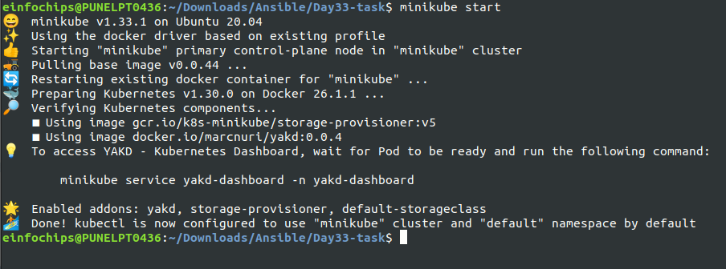

- Using below command, Install and configure Helm on the local machine.
```bash
curl https://raw.githubusercontent.com/helm/helm/main/scripts/get-helm-3 | bash
helm repo add stable https://charts.helm.sh/stable
helm repo update
```

### 2. AWS Services Setup
- **S3 Bucket:** Create an S3 bucket for storing application assets (e.g., static files for the frontend).
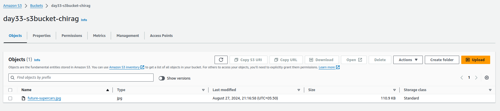
- **RDS Instance:** Set up an Amazon RDS MySQL instance in the free tier.
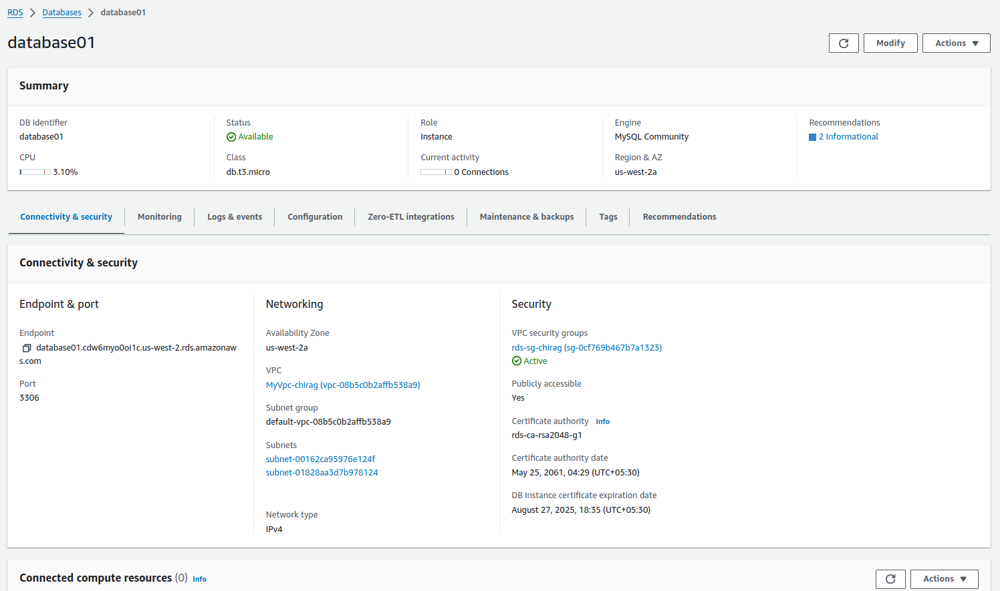

### 3. Create Helm Charts
- **Frontend Chart:** Create a Helm chart for a frontend service (e.g., NGINX) that pulls static files from the S3 bucket.
```bash
helm create frontend
```
- **Backend Chart:** Create a Helm chart for a backend service (e.g., a Python Flask API) that connects to the RDS MySQL database.
```bash
helm create backend
```
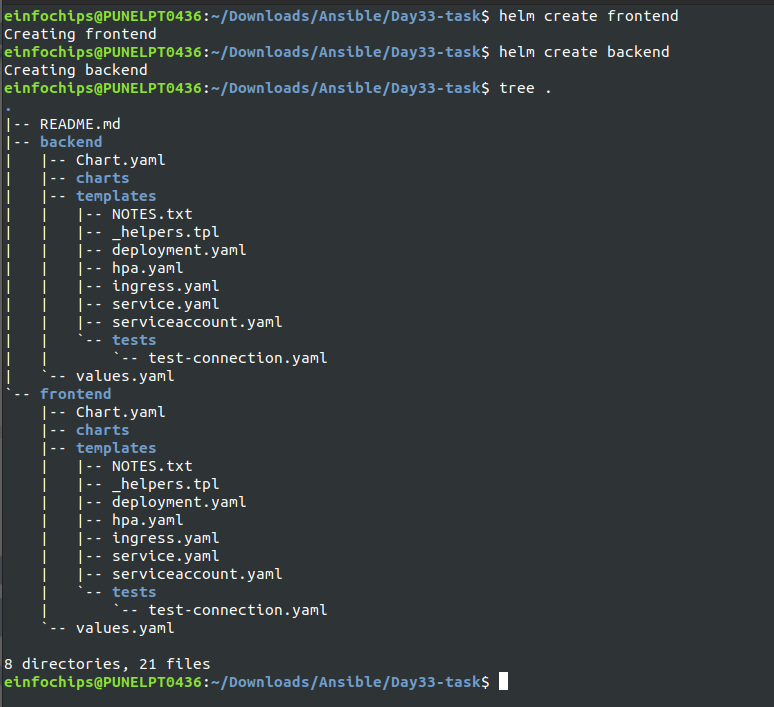

- **Database Chart:** Include configurations for connecting to the RDS MySQL instance in the backend chart.
```bash
helm create database
```
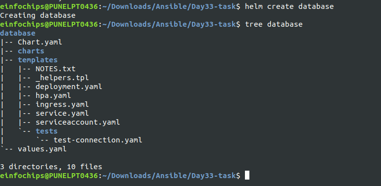

### 4. Package Helm Charts
- Package each Helm chart into a `.tgz` file.
```bash
helm package frontend
helm package backend
```
- Ensure charts are properly versioned.
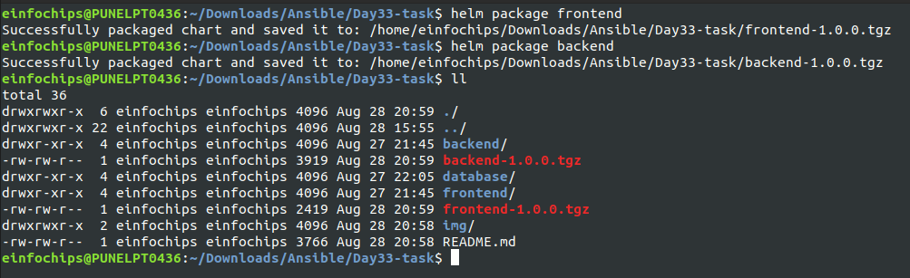

### 5. Deploy Multi-Tier Application Using Helm
- Deploy the database chart (connected to the RDS instance).
- Deploy the backend chart with a dependency on the database chart.
```bash
helm install backend backend-1.1.0.tgz
```
- Deploy the frontend chart with a dependency on the backend service, ensuring it pulls assets from the S3 bucket.
```bash
helm install frontend frontend-1.1.0.tgz
```
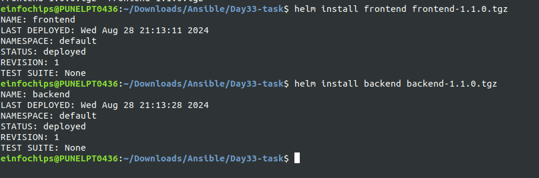
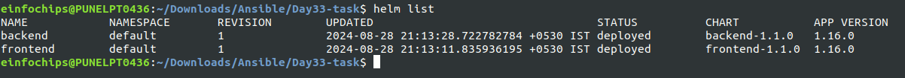

### 6. Manage Helm Secrets
- Implement Helm secrets for managing sensitive data such as database credentials and S3 access keys.
```bash
apiVersion: v1
kind: Secret
metadata:
  name: backend-secrets
  labels:
     {{- include "backend.labels" . | nindent 4 }}
type: Opaque
data:
  db_host: {{ .Values.mysql.host | b64enc | quote }}
  db_port: {{ .Values.mysql.port | b64enc | quote }}
  db_user: {{ .Values.mysql.user | b64enc | quote }}
  db_password: {{ .Values.mysql.password | b64enc | quote }}

```
- Update the backend chart to use these secrets for connecting to the RDS instance and S3.
```bash
# update the deployment.yaml file by adding this
  env:
    - name: DB_HOST
        valueFrom:
        secretKeyRef:
            name: backend-secrets
            key: db_host
    - name: DB_PORT
        value: {{ .Values.mysql.port | quote }}
    - name: DB_USER
        valueFrom:
        secretKeyRef:
            name: backend-secrets
            key: db_user
    - name: DB_PASSWORD
        valueFrom:
        secretKeyRef:
            name: backend-secrets
            key: db_password
    resources:
    {{- toYaml .Values.resources | nindent 12 }}
```

### 7. Implement RBAC
- Define RBAC roles and role bindings to manage permissions for Helm deployments.
```bash
kubectl apply -f helm-service-account.yaml
kubectl apply -f helm-Role.yaml
kubectl apply -f helm-rolebinding.yaml
```

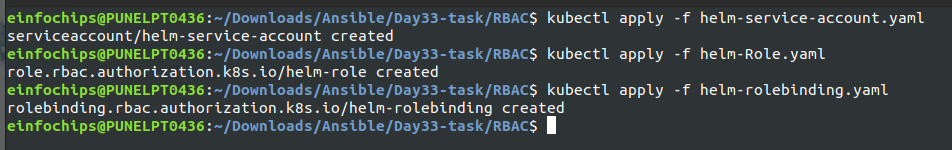

- Ensure that only authorized users can deploy or modify the Helm releases.
```bash
kubectl auth can-i get pods --as system:serviceaccount:default:helm-service-account
```
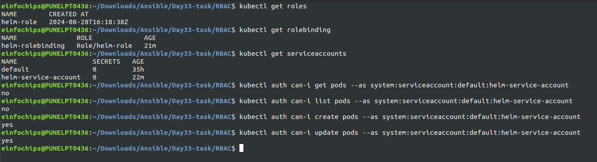

### 8. Versioning and Rollback
- Update the version of one of the Helm charts (e.g., update the frontend service).
```bash
image:
  repository: chirag1212/day33-task
  pullPolicy: IfNotPresent
  tag: frontend-v4  # changed the image version from 3 to 4
```
- upgrade the cluster using below cmd
```bash
helm package frontend
helm upgrade frontend frontend-1.1.1.tgz
```
- Verify the new version of the frontend service.
```bash
helm history frontend
```
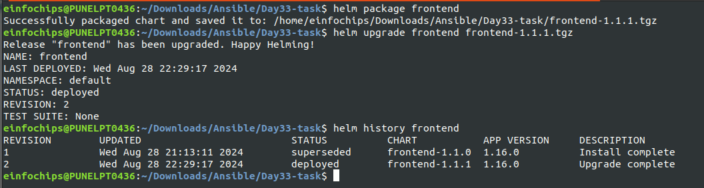

- Perform a rollback if necessary and validate the application functionality.
```bash
helm rollback frontend 1 
helm history frontend
```

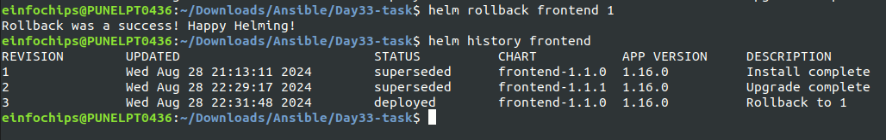

### 9. Validate Deployment
- Ensure the frontend service is serving files from the S3 bucket.
```bash
kubectl port-forward service/frontend-service 8085:80
```
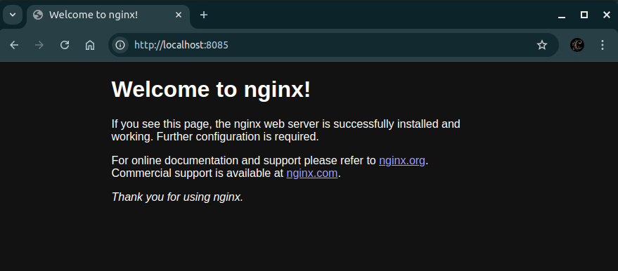

- Validate that the backend service is successfully communicating with the RDS MySQL database.
- Test the overall functionality of the deployed application.
```bash
kubectl get pods
kubectl get services
kubectl get deployments
```
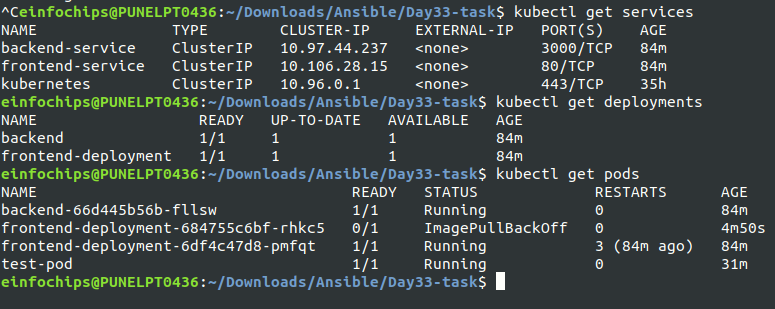

### 10. Cleanup
- Delete all Helm releases and Kubernetes resources created during the project.
```bash
helm uninstall frontend
helm uninstall backend
```
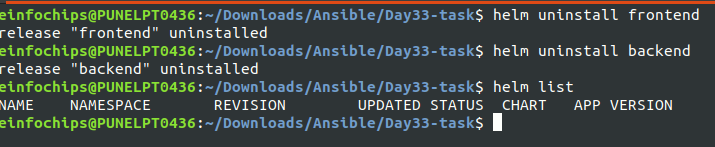
- Terminate the RDS instance and delete the S3 bucket.
- Stop Minikube if no longer needed.
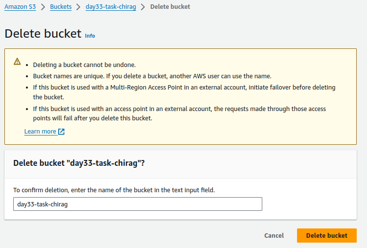
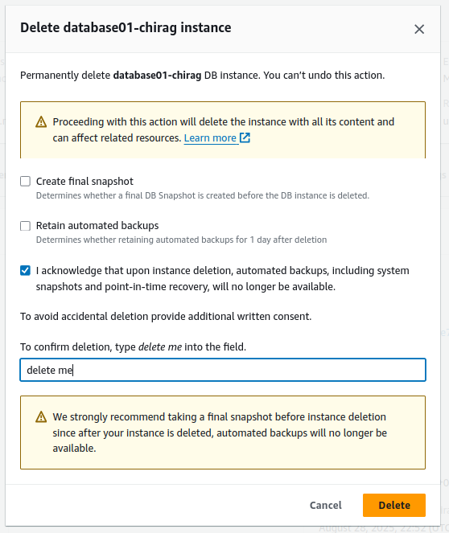

## Conclusion
This project provides a hands-on experience in deploying a multi-tier application using Helm in a Kubernetes environment while leveraging AWS services. The steps cover the entire lifecycle, from setup and deployment to management and cleanup, ensuring a comprehensive understanding of cloud-native application management.
