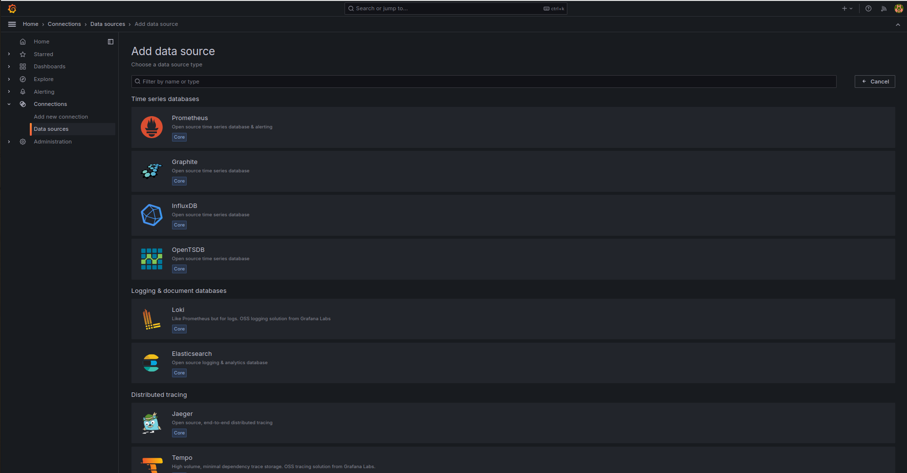
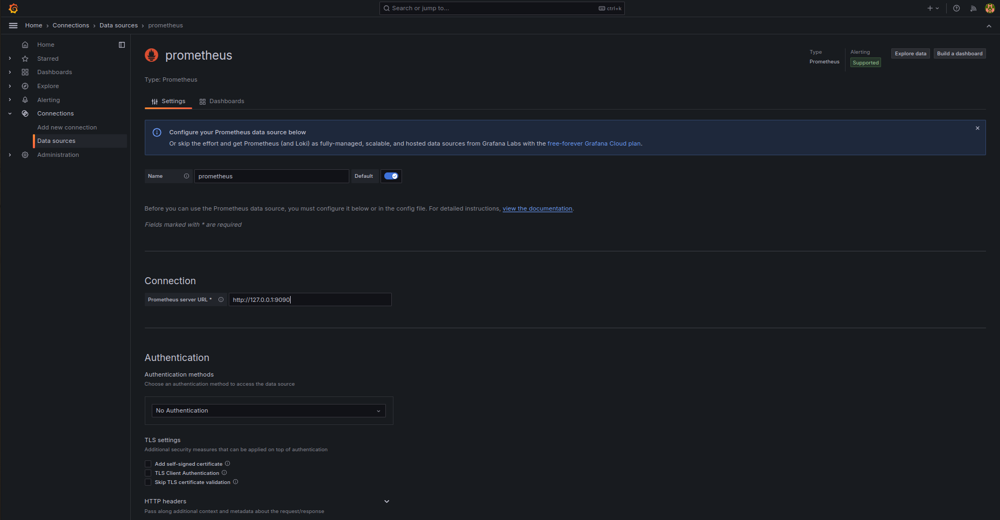

# Install Grafana on Debian or Ubuntu

## Complete the following steps to install Grafana from the APT repository:

### `Step 1`: Install the prerequisite packages
```bash
sudo apt-get install -y apt-transport-https software-properties-common wget
```

### `Step 2`: Import the GPG key
```bash
sudo mkdir -p /etc/apt/keyrings/
wget -q -O - https://apt.grafana.com/gpg.key | gpg --dearmor | sudo tee /etc/apt/keyrings/grafana.gpg > /dev/null
```
### `Step 3`: To add a repository for stable releases, run the following command
```bash
echo "deb [signed-by=/etc/apt/keyrings/grafana.gpg] https://apt.grafana.com stable main" | sudo tee -a /etc/apt/sources.list.d/grafana.list
```

### `Step 4`: To add a repository for beta releases, run the following command
```bash
echo "deb [signed-by=/etc/apt/keyrings/grafana.gpg] https://apt.grafana.com beta main" | sudo tee -a /etc/apt/sources.list.d/grafana.list
```
### `Step 5`: Run the following command to update the list of available packages
```bash
# Updates the list of available packages
sudo apt-get update
```
### `Step 6`: To install Grafana OSS, run the following command
```bash
# Installs the latest OSS release:
sudo apt-get install grafana
```

### `Step 7`: To install Grafana Enterprise, run the following command
```bash
# Installs the latest Enterprise release:
sudo apt-get install grafana-enterprise
```

### `Step 8`: Start the systemd service for Grafana server
```bash
sudo systemctl start grafana-server
```

### Grafan working on port 3000


### Add Data Source



### Configure Prometheus as Data Sources



### Dashboards


